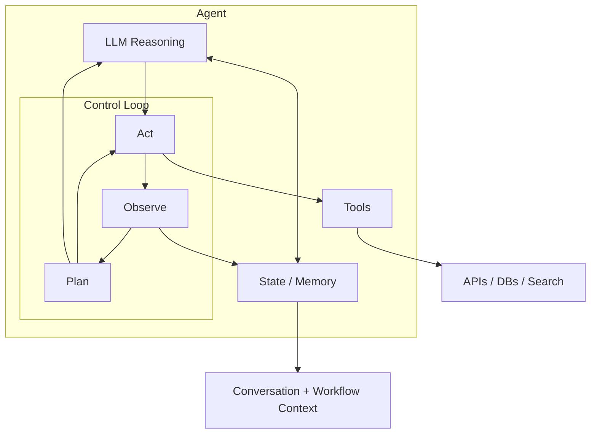
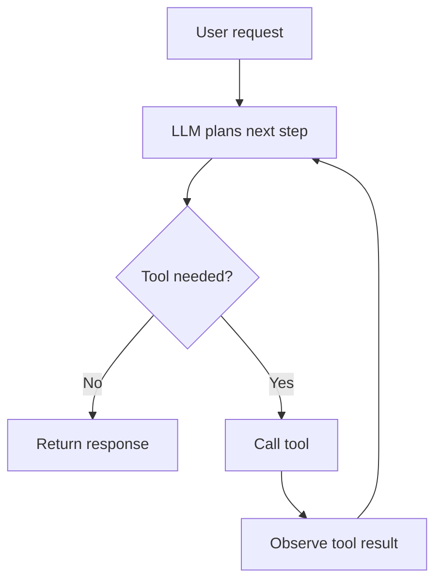
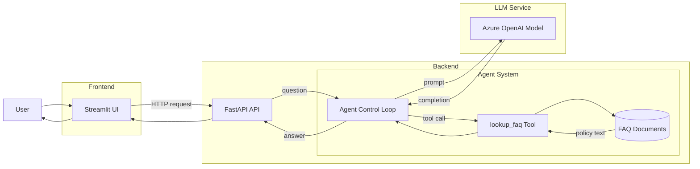

# From LLMs to AI Agents — Why a Prompt Is Not Enough

You have probably used AI assistants like **[ChatGPT](https://chat.openai.com/)**, **[Grok](https://x.ai/)**, or **[DeepSeek](https://www.deepseek.com/)**. They are great for everyday work: summarizing documents, explaining logs, writing SQL, generating Python snippets, troubleshooting errors, or drafting emails and reports. Under the hood, these assistants are powered by **Large Language Models (LLMs)** — models trained on vast amounts of text to understand and generate language. If you are like most people, you have also noticed the assistant gets better when you **paste in more context**: more tables, more logs, more documentation, more examples.

That ceiling — the point where pasting more context stops being enough — is where a plain LLM falls short and an agent takes over. To be truly useful in a business context, an assistant must **retrieve the right context** automatically (for example, fetching the latest policy page rather than relying on whatever you pasted last week), **take actions through tools** (like querying a database or calling an API), and **keep state** (remembering earlier steps in a workflow or a multi-turn investigation). That is what AI agents add on top of LLMs.

In this post, we will build a small **internal policy assistant** that answers release-freeze and incident questions, and use it as the running example for the series.

---

## LLM vs agent

### Where LLMs are genuinely useful

For many everyday business tasks, a well-prompted LLM is all you need. In these cases *you* are the one doing the retrieval (you paste the content in) and *you* are the one taking action (you run the SQL, you send the email). The LLM handles only the language part:

| Business task | What the LLM does |
|---|---|
| Draft a post-incident summary | Reads the log you paste, writes a clear narrative |
| Generate SQL from natural language | Turns "show me last month's top customers" into a working query |
| Explain a cryptic error message | Reads the stack trace and describes the likely cause |
| Write a release note | Takes a list of changes and produces a professional summary |
| Summarise a long policy document | Condenses 20 pages into 5 bullets |

### Where LLMs fall short — and need an agent

The moment the *retrieval*, *action*, or *memory* must happen **automatically and repeatedly**, a standalone LLM breaks down:

| Business need | Why the LLM alone fails |
|---|---|
| "Answer questions about our *current* release freeze policy" | The LLM was trained months ago. It cannot fetch the live policy document. |
| "Alert me if this log pattern appears again within an hour" | The LLM has no memory between calls. Each prompt starts from zero. |
| "Raise a PagerDuty ticket if the on-call engineer hasn't acknowledged the SEV1" | The LLM cannot call external APIs or take actions in other systems. |
| "Walk an engineer through an incident response *step by step*, checking each step is complete before moving on" | The LLM cannot maintain workflow state across multiple turns reliably. |

In each case, the language capability of the LLM is still exactly what you want — you just need to give it **hands** (tools to call), **memory** (state that persists), and a **driver** (a loop that keeps it on task). That is where an agent comes in.

---

## What makes an agent

An agent does not replace the LLM — it **builds around it**.

The LLM remains the reasoning core, doing what it does best: interpreting language, planning steps, and generating responses. What an agent framework adds are the capabilities needed to turn that reasoning into a reliable multi-step system.

In practice, three capabilities are required:

**Tools** — functions or APIs the agent can call so it can act on the world, not just describe it.
In the policy assistant, this means fetching the actual release-freeze document rather than guessing its contents.

**State** — memory and context that persists across steps so the agent can remember what it has already retrieved, decided, or been told.
Without state, every turn starts from scratch.

**Control loop** — a repeatable plan → act → observe cycle that drives the workflow forward until the task is complete.

These three pieces turn a single LLM call into a structured reasoning process.

### How these pieces fit together

Once these components are defined, the overall architecture becomes easier to understand. The LLM acts as the reasoning engine, the control loop orchestrates each step of the workflow, tools connect the agent to external systems, and state carries context across the entire process.

The diagram below shows how these parts interact.


```mermaid
flowchart TB
  subgraph Agent
    LLM[LLM Reasoning]
    Tools[Tools]
    State[State / Memory]
    subgraph Control_Loop[Control Loop]
      Plan[Plan]
      Act[Act]
      Observe[Observe]
      Plan --> Act --> Observe --> Plan
    end
  end
  Plan --> LLM
  LLM --> Act
  Act --> Tools
  Tools --> APIs[APIs / DBs / Search]
  Observe --> State
  LLM <--> State
  State --> Context[Conversation + Workflow Context]
```

Two connections are particularly important.

**State ↔ LLM**
Every decision the agent makes is informed by the current state. This is what allows the agent to remember that you already asked for the SEV1 policy and avoid fetching it repeatedly.

**Tools → External systems**
Tools allow the agent to retrieve real data from APIs, databases, and internal systems rather than relying on training data alone.

Together, these components allow the agent to reason, retrieve information, and maintain continuity across steps.

### The control loop at runtime

The architecture diagram shows the static structure of the system. What actually happens when a user sends a request?

Each message triggers the control loop, which repeatedly executes three steps:

1. **Plan** — the LLM reads the current state and decides what to do next.
2. **Act** — it either calls a tool (if more information or an action is required) or produces a response.
3. **Observe** — the result of the action is added to state, allowing the agent to continue reasoning.


```mermaid
flowchart TD
    A[User request] --> B[LLM plans next step]
    B --> C{Tool needed?}
    C -- No --> D[Return response]
    C -- Yes --> E[Call tool]
    E --> F[Observe tool result]
    F --> B
```

This loop is what makes agent systems different from a simple LLM prompt. Instead of producing a single answer, the agent can retrieve information, perform actions, update its internal state, and iterate until the task is complete.

---

## Frameworks and SDKs

Understanding the loop and the building blocks is the conceptual foundation. Before writing any code, you need to pick the right framework to implement it — because your choice shapes how easy the loop is to build, inspect, and run in production.

A simple way to choose is to compare frameworks on a few **practical metrics**.

### Key metrics to compare

1. **Language support** — Does it match your stack (Python, C#, JS, etc.)?
2. **Tooling & integrations** — Built-in connectors to data, APIs, search, and enterprise tools.
3. **Orchestration features** — Memory, routing, planners, multi-agent support.
4. **Control & transparency** — How easy it is to inspect decisions and failures.
5. **Production readiness** — Deployment patterns, security features, monitoring.
6. **Learning curve** — How fast a beginner can ship something useful.

### Quick comparison

| Framework / SDK | Best for | Lang support | Tooling & integrations | Orchestration | Control & transparency | Production readiness | Learning curve | Strengths | Trade-offs | Recommendation |
|---|---|---|---|---|---|---|---|---|---|---|
| **[Semantic Kernel](https://github.com/microsoft/semantic-kernel)** | Enterprise agents, structured tools | Python, .NET | ✓ Azure, OpenAI, Hugging Face | ✓ Planners, multi-step | ✓ Structured logging | ✓✓ Azure-native | Medium | Tool-first design, strong Azure integration | Smaller community than LangChain | **Best for Azure / .NET enterprise teams** |
| **[LangChain](https://www.langchain.com/)** | Rapid prototyping, broad ecosystem | Python, JS/TS | ✓✓ 100+ integrations | ✓ Chains, agents, memory | ✓ LangSmith tracing | ✓ Broad deployment | Low | Largest community, most examples | Can feel abstract, harder to debug | **Best for beginners & rapid prototyping** |
| **[LlamaIndex](https://www.llamaindex.ai/)** | Data-centric applications | Python, JS/TS | ✓ Data/retrieval focused | ✗ Limited agent orchestration | ✓ Query pipelines | ✓ Pairs with other frameworks | Low | Best-in-class RAG tooling | Not a full agent framework | **Best for RAG & data-heavy applications** |
| **[AutoGen](https://github.com/microsoft/autogen)** | Multi-agent research | Python | ✓ OpenAI, Azure | ✓✓ Multi-agent coordination | ✓ Conversation traces | ✗ Experimental for production | High | Strong multi-agent patterns, active research | Production-readiness gaps | **Best for multi-agent research & experimentation** |
| **[CrewAI](https://www.crewai.com/)** | Role-based agent teams | Python | ✓ OpenAI, Anthropic, local | ✓ Role-based multi-agent | ✓ Basic | ✗ Limited enterprise features | Low | Simple role-based design, minimal boilerplate | Limited scaling & enterprise controls | **Best for quick role-based agent prototypes** |
| **[n8n](https://n8n.io/)** | Low-code workflows | No-code / JS | ✓✓ 400+ integrations | ✓ Visual workflows | ✗ Limited custom logic | ✓ Self-hostable | Very Low | Fast visual automation, no code needed | Not code-first, less flexible for custom logic | **Best for non-developers & low-code automation** |
| **[AWS Strands](https://aws.amazon.com/)** | AWS-native agent stacks | Python | ✓✓ AWS services native | ✓ Step Functions, Bedrock | ✓ CloudWatch, X-Ray | ✓✓ AWS production patterns | Medium | Tight AWS integration, enterprise deployment | AWS-leaning, smaller community outside AWS | **Best for AWS-native production stacks** |
| **[Copilot Studio](https://www.microsoft.com/microsoft-copilot/microsoft-copilot-studio)** | Business users, M365 ecosystem | No-code | ✓ M365, Power Platform | ✓ Visual flows | ✗ Limited debugging | ✓ M365 managed | Very Low | Easy UI, Microsoft ecosystem | Platform constraints, less custom control | **Best for M365 business users, no coding needed** |
| **[Azure AI Studio](https://ai.azure.com/)** | Azure-native build & deploy | Python | ✓✓ Azure-native | ✓ Prompt flow, evaluation | ✓✓ Built-in eval & monitoring | ✓✓ Managed Azure deployment | Medium | Unified model catalog, evaluation, deployment | Azure-centric workflows | **Best for Azure-native build & deployment pipelines** |

For the examples below, we will use **Semantic Kernel (Python)** as a code-first option. The overall flow stays very similar across most frameworks, so feel free to map the same steps to the SDK you prefer.

---


## Building the agent

We have covered the concept (LLM as core, agent wrapping it with tools, state, and a control loop) and chosen a framework (Semantic Kernel). Now let's turn that loop into running code.

To keep the example practical, we will build a small internal policy assistant. The assistant answers questions about release freezes and SEV1 incidents by retrieving the correct internal FAQ document.

Rather than running only as a script, we will structure the example the way real agent systems are deployed:

- a **frontend UI** where a user asks a question
- a **backend API** that receives requests
- an **agent system** that performs the reasoning and tool calls
- an **LLM service** that powers the reasoning

The architecture looks like this.


```mermaid
flowchart LR

  %% User
  User[User]

  %% Frontend
  subgraph Frontend
    UI[Streamlit UI]
  end

  %% Backend
  subgraph Backend
    API[FastAPI API]

    subgraph Agent_System[Agent System]
      Agent[Agent Control Loop]
      Tool[lookup_faq Tool]
      Docs[(FAQ Documents)]
    end
  end

  %% LLM
  subgraph LLM_Service[LLM Service]
    LLM[Azure OpenAI Model]
  end

  %% Flow
  User --> UI
  UI -->|HTTP request| API
  API -->|question| Agent

  Agent -->|tool call| Tool
  Tool --> Docs
  Docs -->|policy text| Tool
  Tool --> Agent

  Agent -->|prompt| LLM
  LLM -->|completion| Agent

  Agent -->|answer| API
  API --> UI
  UI --> User
```

The important design choice here is separating the agent, API, and UI. The agent contains the reasoning loop, the API exposes it over HTTP, and the UI simply calls that API. This mirrors how most production systems are structured and makes the agent reusable across different clients (web apps, Slack bots, CI pipelines, and so on).

We will implement the system in three small files:

- **`agent.py`** — the agent logic (LLM + tools + control loop)
- **`api.py`** — a thin HTTP wrapper around the agent
- **`streamlit.py`** — a minimal browser UI

> **Prerequisites:**
> - Azure OpenAI resource with a deployed model (e.g., `gpt-4o-mini`)
> - Python 3.10+ with `semantic-kernel` installed
> - A folder of `.txt` files for FAQs (one policy per file)

**Model recommendations**

The model you choose affects response quality, latency, and cost on every call. For this series, all three matter — but they matter differently at different stages.

| Model | Best for | Typical latency | Relative cost |
|---|---|---|---|
| `gpt-4o-mini` | Prototyping, FAQ retrieval, low-complexity queries | Fast | Low |
| `gpt-4o` | Production agents, nuanced reasoning, structured output | Medium | Medium |
| `o3-mini` | Multi-step reasoning, complex planning, chain-of-thought | Slower | High |

**For this blog:** `gpt-4o-mini` is sufficient. The agent is doing simple FAQ retrieval — tool selection and direct answering, not complex reasoning. Using a more capable model here provides no measurable benefit.

**When to step up to `gpt-4o`:** When the agent must follow multi-condition instructions reliably, produce structured output (JSON schemas, step-by-step plans), or when response quality is directly visible to end users.

**When to consider `o3-mini`:** When the agent needs extended chain-of-thought reasoning — for example, diagnosing a multi-system incident or decomposing a complex query into a sequence of tool calls. Note that `o3-mini` is not available in all Azure regions; check the [model availability page](https://learn.microsoft.com/azure/ai-services/openai/concepts/models) before planning around it.

**A practical rule:** start with `gpt-4o-mini`, measure where it falls short, then upgrade the specific deployment that is underperforming. Upgrading everything at once makes it harder to isolate what actually improved.

> **No Azure subscription yet?** **[free-llm-api-resources](https://github.com/cheahjs/free-llm-api-resources)** is a regularly updated GitHub repository that tracks free tiers, trial credits, and open-access endpoints across many providers. It is a practical starting point if you want to experiment before committing to a paid service.

### The agent code

Before looking at the full implementation, it helps to recognise four recurring patterns that appear in most agent code:

1. **Model configuration** — gives the agent its reasoning core (the LLM). Without this, nothing thinks.
2. **System prompt** — shapes the agent's persona, scope, and behaviour. It tells the LLM *who it is*, *what it knows*, and *when to use a tool*. The LLM reads this on every turn before deciding how to respond.
3. **Tool registration** — defines what the agent can *do* beyond generating text. This is the "act" phase of the loop.
4. **Execution call** — triggers the plan → act → observe cycle and returns a grounded answer.

**agent.py**

```python
import os
import asyncio
from pathlib import Path

from semantic_kernel.agents import ChatCompletionAgent
from semantic_kernel.connectors.ai.open_ai import AzureChatCompletion, OpenAIChatPromptExecutionSettings
from semantic_kernel.functions import kernel_function, KernelArguments

# --- Configuration ---
# Load credentials from a .env file so secrets never appear in source code.
# Falls back to real environment variables if .env is absent (e.g. in CI/CD).
from dotenv import load_dotenv
load_dotenv()

AZURE_OPENAI_ENDPOINT = os.environ["AZURE_OPENAI_ENDPOINT"]
AZURE_OPENAI_KEY = os.environ["AZURE_OPENAI_API_KEY"]
AZURE_OPENAI_DEPLOYMENT = os.environ["AZURE_OPENAI_DEPLOYMENT"]  # e.g. "gpt-4o-mini"

FAQ_DIR = Path("../data/faq_docs")

def load_faq_docs() -> dict[str, str]:
    """Load each .txt file into a {key: content} dictionary."""
    docs = {}
    for path in FAQ_DIR.glob("*.txt"):
        docs[path.stem] = path.read_text(encoding="utf-8").strip()
    return docs

FAQ = load_faq_docs()  # Loaded once at startup; acts as the agent's private knowledge base

# --- Tool registration ---
# This class is the agent's only "action": retrieve a policy document by name.
# The @kernel_function decorator registers it so the LLM can invoke it by name.
class InternalFaqTool:
    @kernel_function(
        name="lookup_faq",
        description="Lookup an internal policy document by key. "
                    "Valid keys: 'release-freeze', 'incident-sev1'.",
    )
    def lookup_faq(self, key: str) -> str:
        return FAQ.get(key, "Policy not found. Please check with your Release Manager.")

# --- System prompt ---
# Shapes the agent's persona, scope, and when to call a tool.
# The LLM reads this on every turn before deciding how to respond.
instructions = """
You are a helpful internal knowledge assistant.
If you need a policy, call the lookup_faq tool.

You can answer questions about:
- Release freeze timelines and what is allowed during the freeze
- SEV1 incident handling, roles, escalation, and communication
"""

# --- LLM parameters ---
# These settings are passed to the LLM on every call.
SETTINGS = OpenAIChatPromptExecutionSettings(
    temperature=0.2,  # Lower temperature for more consistent, factual responses
    max_tokens=500,   # Limit output length
    tool_choice="auto",  # Let the model decide when to call tools
)

# --- Model configuration ---
# Wires together the LLM service, system prompt, tool, and call settings.
_agent = ChatCompletionAgent(
    service=AzureChatCompletion(       # Connects to Azure OpenAI — this is the LLM API endpoint
        deployment_name=AZURE_OPENAI_DEPLOYMENT,
        endpoint=AZURE_OPENAI_ENDPOINT,
        api_key=AZURE_OPENAI_KEY,
    ),
    name="Policy-Assistant",
    instructions=instructions,         # System prompt
    plugins=[InternalFaqTool()],       # Registered tools
    arguments=KernelArguments(SETTINGS),
)

# --- Execution call ---
# get_response triggers the full plan -> act -> observe loop:
# the LLM decides whether to call a tool or respond directly.
async def ask_agent(question: str) -> str:
    response = await _agent.get_response(messages=question)
    return response.content

async def main() -> None:
    user_question = input(
        "Ask a policy question (e.g., release freeze timing or SEV1 escalation): "
    ).strip()
    answer = await ask_agent(user_question)
    print(answer)

if __name__ == "__main__":
    asyncio.run(main())
```

The agent now works from the command line. To make it usable by other systems, we expose it through a simple HTTP API. The API layer is intentionally thin — it simply receives a question and delegates to the agent. Keeping this layer minimal ensures the agent logic remains reusable.

**api.py**

```python
from fastapi import FastAPI
from pydantic import BaseModel

from agent import ask_agent  # Imports the agent loop defined in agent.py

app = FastAPI()

# Request schema — validates and documents the expected JSON body
class Query(BaseModel):
    question: str

# POST /ask — receives the user's question and returns the agent's answer.
# Keeping this thin means the same agent can be reused by any client
# (CLI, Streamlit, Slack bot, etc.) without changing agent.py.
@app.post("/ask")
async def ask(query: Query):
    answer = await ask_agent(query.question)  # Delegates to the agent loop (LLM call happens here)
    return {"answer": answer}
```

Finally, we add a minimal browser interface using Streamlit. The UI sends the user's question to the API and displays the returned answer. This layer contains no agent logic — it simply acts as a client.

**streamlit.py**

```python
import requests
import streamlit as st

st.title("Policy Assistant")
question = st.text_input("Ask a policy question")

if st.button("Ask") and question:
    # Send the question to the FastAPI backend via HTTP POST.
    # The backend delegates to the agent, which calls the LLM and returns an answer.
    response = requests.post("http://127.0.0.1:8000/ask", json={"question": question})
    if response.ok:
        st.write(response.json()["answer"])  # Display the agent's response
    else:
        st.error("Request failed")
```

---

## Example run

```bash
# 1) Create and activate a virtual environment
python -m venv .venv
.venv\Scripts\activate          # Windows
# source .venv/bin/activate     # macOS / Linux

# 2) Install dependencies from requirements.txt
pip install -r requirements.txt

# 3) Create a .env file from the provided template and fill in your credentials
# .env is already listed in .gitignore — never commit real secrets to source control
cp .env.template .env
# Then open .env and replace the placeholder values with your Azure OpenAI details

# 4) Run the agent locally (CLI)
python agent.py

# 5) Start the API server (keep this running)
uvicorn api:app --reload

# 6) Test the API in a new terminal
curl -X POST http://127.0.0.1:8000/ask \
  -H "Content-Type: application/json" \
  -d "{\"question\": \"When does release freeze start?\"}"

# 7) Run the Streamlit UI in another terminal
streamlit run streamlit.py
```

---

## Closing note

Try swapping the FAQ `.txt` files, add one more tool, and watch how the loop behaves. You can also tweak the **prompt**, change the **model deployment**, or adjust **temperature/max_tokens** to see how the agent's behaviour shifts. Keeping changes small and observable is the fastest way to get confident with agents.

**What's next:** in the next post we will focus on prompt engineering and explicit agent state to make behaviour predictable and debuggable.
