# From LLMs to AI Agents — Why a Prompt Is Not Enough

## Intro
You have probably used tools like **[ChatGPT](https://chat.openai.com/)**, **[Grok](https://x.ai/)**, or **[DeepSeek](https://www.deepseek.com/)**. They are great for everyday work: summarizing documents, explaining logs, writing SQL, generating Python snippets, troubleshooting errors, or drafting emails and reports. If you are like most people, you have also noticed the model gets better when you **paste in more context**: more tables, more logs, more documentation, more examples.

Large Language Models (LLMs) are powerful, but a prompt alone is not enough for real systems. A helpful assistant must **retrieve the right context** (for example, the latest policy page instead of whatever you pasted last week), **take actions through tools** (like querying a database or calling an API), and **keep state** (remembering earlier steps in a workflow or a multi‑turn investigation). That is what AI agents add on top of LLMs.

---

## LLM vs Agent
Think of an LLM as a **very capable text engine**. You can ask it a question and it responds well. But if you ask it to *act*—look up a policy, query a database, call an API, or remember what happened earlier—it falls short. It is brilliant at language, but it does not carry a workflow on its own.

An agent is designed to carry that workflow. It **builds on an LLM** by wrapping it in the pieces that make it actionable and repeatable.

On its own, an LLM **does not**:

- Know your private data by default
- Persist memory across runs
- Execute actions (APIs, tools, databases)
- Maintain long-running state or goals

So if you want an assistant that answers internal questions and triggers workflows, you need more than a prompt. You need an **agent system**.

---

An agent is a **goal‑driven system** that wraps an LLM with three critical capabilities:

1. **Tools** — the ability to call APIs or functions
2. **State** — memory and context across steps
3. **Control loop** — a repeatable plan/act/observe cycle


That is why agent code has a few extra moving parts compared to a plain LLM call.

---

## Agent Loop
Here is the simple loop most agents follow:

1. **Plan** what to do next
2. **Act** by calling a tool or generating a response
3. **Observe** the result and update state

Here is the minimal loop that guides the code we will write:


This loop is the reason you see tool definitions, an execution kernel, and a memory or state store in agent code.

---

## Why Each Code Step Exists
When you build your first agent, three pieces of code show up again and again. Each has a clear purpose:

1. **Model configuration** — to give the agent a brain (LLM)
2. **Tool registration** — to let it do something beyond text
3. **Execution call** — to run the loop and get a grounded answer

We will keep the tools minimal and focus on the reasoning behind each step.

---

## Frameworks and SDKs (and how to compare them)
Before jumping into code, it helps to scan the **agent frameworks and SDKs** you will see in the wild. A simple way to choose is to compare them on a few **practical metrics**.

### Key metrics to compare
1. **Language support** — Does it match your stack (Python, C#, JS, etc.)?
2. **Tooling & integrations** — Built-in connectors to data, APIs, search, and enterprise tools.
3. **Orchestration features** — Memory, routing, planners, multi-agent support.
4. **Control & transparency** — How easy it is to inspect decisions and failures.
5. **Production readiness** — Deployment patterns, security features, monitoring.
6. **Learning curve** — How fast a beginner can ship something useful.

### Quick comparison (high-level)
| Framework / SDK | Best for | Strengths | Trade-offs |
|---|---|---|---|
| **[Semantic Kernel](https://github.com/microsoft/semantic-kernel)** | Enterprise agents, structured tools | Strong .NET and Python support, tool-first design, integrates well with Azure | Smaller ecosystem than LangChain, fewer community examples |
| **[LangChain](https://www.langchain.com/)** | Rapid prototyping, broad ecosystem | Large community, many integrations, lots of examples | Can feel abstract, harder to debug complex chains |
| **[LlamaIndex](https://www.llamaindex.ai/)** | Data-centric applications | Excellent retrieval/RAG tooling | Not a full agent framework by itself |
| **[AutoGen](https://github.com/microsoft/autogen)** | Multi-agent research | Strong multi-agent patterns, active research | More experimental for production |
| **[CrewAI](https://www.crewai.com/)** | Role-based agent teams | Simple multi-agent design patterns | Limited enterprise features |
| **[n8n](https://n8n.io/)** | Low-code workflows | Visual orchestration, great for non-devs, fast automation | Less flexible for custom agent logic, not code-first |
| **[AWS Strands](https://aws.amazon.com/)** | AWS-native agent stacks | Tight AWS integrations, enterprise deployment patterns | AWS-leaning, smaller community outside AWS |
| **[Copilot Studio](https://www.microsoft.com/microsoft-copilot/microsoft-copilot-studio)** | Business users, M365 ecosystem | Easy UI, Microsoft ecosystem integration | Less control for custom architectures, platform constraints |
| **[Azure AI Studio](https://ai.azure.com/)** | Azure-native build & deploy | Unified model catalog, evaluation and deployment | Azure-centric workflows |

For the examples below, we will use **Semantic Kernel (Python)** as a **code‑first** option. The overall flow stays very similar across most frameworks, so feel free to map the same steps to the SDK you prefer.

---

## Minimal Agent (SK + Azure OpenAI)
Below is a minimal, working example. It answers a real policy question using a tiny internal FAQ tool.

> **Prerequisites:**
> - Azure OpenAI resource with a deployed model (e.g., `gpt-4o-mini`)
> - Python 3.10+ with `semantic-kernel` installed
> - A folder of `.txt` files for FAQs (one policy per file)

**Model recommendations**
- **Balanced cost/performance:** `gpt-4o-mini`
- **Higher accuracy:** `gpt-4o`
- **Fast + inexpensive for experiments:** `gpt-3.5-turbo` (if available in your Azure region)

For guidance on choosing models, see **[Azure OpenAI model selection](https://learn.microsoft.com/azure/ai-services/openai/concepts/models)**.

### Full example

**agent.py**

```python
import os
import asyncio
from pathlib import Path

from semantic_kernel.agents import ChatCompletionAgent
from semantic_kernel.connectors.ai.open_ai import AzureChatCompletion, OpenAIChatPromptExecutionSettings
from semantic_kernel.functions import kernel_function, KernelArguments

# Azure OpenAI environment variables
AZURE_OPENAI_ENDPOINT = os.environ["AZURE_OPENAI_ENDPOINT"]
AZURE_OPENAI_KEY = os.environ["AZURE_OPENAI_API_KEY"]
AZURE_OPENAI_DEPLOYMENT = os.environ["AZURE_OPENAI_DEPLOYMENT"]

FAQ_DIR = Path("./faq_docs")  # Folder containing .txt files

def load_faq_docs() -> dict[str, str]:
    """Load each .txt file into a {key: content} dictionary."""
    docs = {}
    for path in FAQ_DIR.glob("*.txt"):
        docs[path.stem] = path.read_text(encoding="utf-8").strip()
    return docs

FAQ = load_faq_docs()

class InternalFaqTool:
    @kernel_function(
        name="lookup_faq",
        description="Lookup internal policy or FAQ by key",
    )
    def lookup_faq(self, key: str) -> str:
        return FAQ.get(key, "No policy found for that key.")

instructions = """
You are a helpful internal knowledge assistant.
If you need a policy, call the lookup_faq tool.

You can answer questions about:
- Release freeze timelines and what is allowed during the freeze
- SEV1 incident handling, roles, escalation, and communication
"""

settings = OpenAIChatPromptExecutionSettings(
    temperature=0.2,  # Lower temperature for more consistent, factual responses
    max_tokens=500,   # Limit output length
    tool_choice="auto",  # Let the model decide when to call tools
)

_agent = ChatCompletionAgent(
    service=AzureChatCompletion(
        deployment_name=AZURE_OPENAI_DEPLOYMENT,
        endpoint=AZURE_OPENAI_ENDPOINT,
        api_key=AZURE_OPENAI_KEY,
    ),
    name="Policy-Assistant",
    instructions=instructions,
    plugins=[InternalFaqTool()],
    arguments=KernelArguments(settings),
)

async def ask_agent(question: str) -> str:
    response = await _agent.get_response(messages=question)
    return response.content

async def main() -> None:
    user_question = input(
        "Ask a policy question (e.g., release freeze timing or SEV1 escalation): "
    ).strip()
    answer = await ask_agent(user_question)
    print(answer)

if __name__ == "__main__":
    asyncio.run(main())
```

---

## Serve the agent via API + simple UI (final step)
Keeping the **backend (API)** separate from the **frontend (UI)** is a standard practice. It makes the agent reusable across multiple clients.

```mermaid
flowchart LR
  User[👤 User] --> FE_UI

  subgraph Frontend
    FE_UI[Browser UI - Streamlit]
  end

  subgraph Backend
    API[FastAPI Backend]
    subgraph Agent_System[Agent System]
      Agent[Agent]
      Files[FAQ txt files]
    end
  end

  subgraph LLM_Service[LLM Service]
    LLM[Azure OpenAI Endpoint]
  end

  FE_UI -->|1. HTTP API call| API
  API -->|2. Forward question| Agent
  Agent -->|3. Tool call: lookup_faq| Files
  Files -->|4. Retrieved context| Agent
  Agent -->|5. LLM call| LLM
  LLM -->|6. Response| Agent
  Agent -->|7. Answer| API
  API -->|8. Response| FE_UI
```



### API server (FastAPI)
**api.py**

```python
from fastapi import FastAPI
from pydantic import BaseModel

from agent import ask_agent

app = FastAPI()

class Query(BaseModel):
    question: str

@app.post("/ask")
async def ask(query: Query):
    answer = await ask_agent(query.question)
    return {"answer": answer}
```

**Terminal**

```bash
pip install fastapi uvicorn
uvicorn api:app --reload
```

**Terminal (curl)**

```bash
curl -X POST http://127.0.0.1:8000/ask \
  -H "Content-Type: application/json" \
  -d "{\"question\": \"When does release freeze start?\"}"
```

### Simple Streamlit UI
**streamlit.py**

```python
import requests
import streamlit as st

st.title("Policy Assistant")
question = st.text_input("Ask a policy question")

if st.button("Ask") and question:
    response = requests.post("http://127.0.0.1:8000/ask", json={"question": question})
    if response.ok:
        st.write(response.json()["answer"])
    else:
        st.error("Request failed")
```

**Terminal**

```bash
pip install streamlit requests
streamlit run streamlit.py
```

---

## Example run
**Terminal**

```bash
# 1) Create and activate a virtual environment
python -m venv .venv
.venv\Scripts\activate

# 2) Install the SDK
pip install semantic-kernel

# 3) Run the agent
python agent.py
```

### Closing note
Try swapping the FAQ `.txt` files, add one more tool, and watch how the loop behaves. You can also tweak the **prompt**, change the **model deployment**, or adjust **temperature/max_tokens** to see how the agent’s behavior shifts. Keeping changes small and observable is the fastest way to get confident with agents.