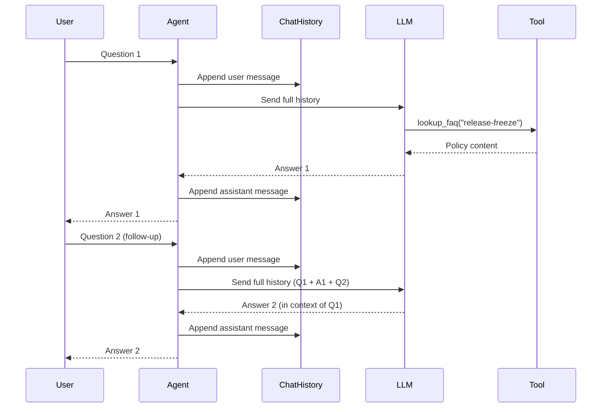
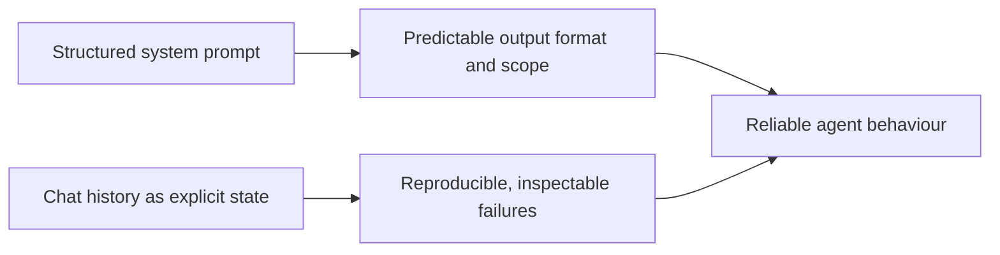

# Controlling Agent Behaviour — Prompt Engineering and State

## Recap and what this post adds

In the [previous post](../blog-01-from-llms-to-agents/blog.md) we built the foundation: a minimal policy assistant that takes a question, calls a tool to retrieve a policy document, and returns a grounded response. We kept it deliberately simple — one tool, a readable prompt, a single-turn call — so the core loop (plan, act, observe) was visible without distraction.

That foundation is solid. Now we add two layers that make it suitable for real, sustained use:

1. **Prompt engineering** — restructuring the system prompt from a readable description into a precise control specification.
2. **Explicit conversation state** — carrying the conversation history across turns so the agent reasons in context, not in isolation.

The code builds directly on what we wrote before. The same FAQ tool, the same Azure OpenAI backend — two targeted upgrades, each with a clear purpose.

---

## Prompts as control mechanisms

The system prompt in the previous post was intentionally minimal: a clear description of the agent's purpose and a note about when to call the tool. That is exactly right as a starting point. As the agent moves toward real use, we need something more precise.

The key shift in thinking: **the system prompt is not a description of the agent — it is the agent's behavioural specification**. Like a configuration file or a contract interface, it defines what the agent does and does not do, and callers depend on it being consistent.

A loosely written prompt leaves several decisions to the model on every call:

- Should it answer questions outside the listed topics?
- Should it summarise or cite verbatim?
- What should it say if the policy document does not cover the question?
- Should it ask clarifying questions or make assumptions?

Because those decisions are implicit, the answers vary. The same question asked twice may produce different structures, different caveats, different lengths. A structured prompt eliminates that variation by making every decision explicit.

> **Further reading:** Anthropic's [Prompt Engineering Overview](https://platform.claude.com/docs/en/build-with-claude/prompt-engineering/overview) covers the principles behind structured prompting in depth. The linked sub-pages on [system prompts](https://platform.claude.com/docs/en/build-with-claude/prompt-engineering/system-prompts-and-instructions) and [reducing hallucinations](https://platform.claude.com/docs/en/build-with-claude/prompt-engineering/reduce-hallucinations) are particularly relevant. OpenAI's [Prompt Engineering Guide](https://platform.openai.com/docs/guides/prompt-engineering) covers similar ground from the GPT side.

### The anatomy of a structured system prompt

A reliable pattern is to divide the system prompt into named sections, each with a single responsibility:

```
[PERSONA]
Who the agent is and the tone it uses.

[SCOPE]
What topics are in and out of bounds.

[TOOL USAGE RULES]
When and how to call available tools.

[RESPONSE FORMAT]
The structure and length constraints on answers.

[BEHAVIOUR UNDER UNCERTAINTY]
What to do when the answer is not known or not in scope.
```

Each section is independently testable. Change the response format without touching the tool usage rules. Narrow the scope without changing the persona. The prompt becomes maintainable in the same way code is.

### The starting prompt (from the previous post)

```python
instructions = """
You are a helpful internal knowledge assistant.
If you need a policy, call the lookup_faq tool.

You can answer questions about:
- Release freeze timelines and what is allowed during the freeze
- SEV1 incident handling, roles, escalation, and communication
"""
```

Clear and readable — a good starting point. What it leaves open: out-of-scope behaviour, output format, what to do when the policy doesn't cover the question, and how to handle ambiguity. Each of those gaps produces variation in answers.

### The structured version

```python
INSTRUCTIONS = """
## PERSONA
You are the internal policy assistant for an engineering team.
You are precise, concise, and cite the specific policy that informs your answer.
You do not use filler phrases like "Great question!" or "Certainly!".

## SCOPE
You answer questions on these topics only:
- Release freeze: timing, allowed changes, exceptions, approvals, rollback.
- SEV1 incidents: definition, roles, timelines, escalation, post-incident requirements.

If a question is outside this scope, respond exactly:
  "I can only answer questions about release freeze and SEV1 incidents."

## TOOL USAGE RULES
- Always call lookup_faq before answering a policy question.
- Call it with the key "release-freeze" for release freeze questions.
- Call it with the key "incident-sev1" for SEV1 questions.
- Do not answer from memory; use only what the tool returns.

## RESPONSE FORMAT
- Answer in plain prose, 3-5 sentences maximum.
- If the answer involves a list of steps or roles, use a numbered or bulleted list.
- End every answer with: "Source: <policy key used>"

## BEHAVIOUR UNDER UNCERTAINTY
- If the tool returns no content for a key, respond: "Policy not found. Please check with your Release Manager."
- If the user's question is ambiguous, ask one clarifying question before calling the tool.
"""
```

Every gap is now closed. The format, scope boundary, fallback behaviour, and citation pattern are all specified. Callers — whether human or automated — can rely on a consistent structure.

---

## Explicit conversation state

The previous post's `ask_agent()` made a single-turn call:

```python
response = await _agent.get_response(messages=question)
```

Passing a bare string to `get_response()` creates a fresh, one-message conversation each time. The SK framework has no opportunity to accumulate history — there is nothing to accumulate. Each call is independent by design.

This is the right approach for a single-question agent. For multi-turn use it produces a familiar problem: the agent answers each question in isolation, with no knowledge of what came before.

```
User:  When does the release freeze start?
Agent: The freeze begins 48 hours before the release window.

User:  And what changes are allowed during that period?
Agent: [No context — "that period" is unresolved]

User:  Who approves exceptions?
Agent: [No context — "exceptions" to what is unresolved]
```

The model may infer the right context from wording alone, but inference-based correctness is not the same as design-based correctness. Explicit state removes the ambiguity entirely.

**Explicit state** means passing the full conversation history to the LLM on every turn, so each new question is answered in the context of everything that came before.

### How `ChatHistory` works in Semantic Kernel

Semantic Kernel provides a `ChatHistory` object that accumulates messages across turns. We create one per session, append each exchange to it, and pass the whole object to `invoke()` instead of the bare string.



The `ChatHistory` object is the agent's working memory for the session. It is simple, inspectable, and deterministic — print it at any point to see exactly what the LLM received.

---

## State vs memory — a useful distinction

State and memory are related but different:

| | **State (this post)** | **Memory (covered in upcoming posts)** |
|---|---|---|
| **Scope** | Within a single session | Across sessions |
| **Storage** | In-process (`ChatHistory`) | External (vector store, database) |
| **Typical use** | Multi-turn conversation context | Remembering past incidents, user context |
| **Complexity** | Low | Medium–high |

This post covers in-session state. Cross-session memory — retrieving relevant history from a store — is covered in upcoming posts in the series.

---

## What predictable and debuggable means in practice

With a structured prompt and explicit state, two properties follow that matter for production:

**Predictable:** Given the same conversation history and the same policy documents, the agent produces the same category of response. The format, scope, and citation pattern are consistent. Downstream systems can parse the output reliably.

**Debuggable:** When the agent gives a wrong or unexpected answer, you can inspect exactly what it received: the system prompt, the full conversation history, and the tool output. There is no hidden state. The failure is reproducible because the input is fully known.



---

## What changes in the code

The code directory for this post contains the complete updated files. The changes from the previous post are targeted:

| File | What changes |
|---|---|
| `agent.py` | `instructions` → structured `INSTRUCTIONS`; `get_response(str)` → `invoke(ChatHistory)`; session store added; `reset_session()` added |
| `api.py` | `Query` gains `session_id` field; `/reset` endpoint added |
| `streamlit.py` | Single `st.text_input` → multi-turn `st.chat_input` with full chat history display and a reset button |

Here are the diffs for each file. If you are following along, apply these changes to your existing code from the previous post.

---

### `agent.py` — key changes

**1. Add `ChatHistory` import**

```python
# Add this import alongside the existing ones
from semantic_kernel.contents import ChatHistory
```

**2. Replace the system prompt**

```python
# Before
instructions = """
You are a helpful internal knowledge assistant.
If you need a policy, call the lookup_faq tool.
...
"""

# After — structured INSTRUCTIONS constant (see full version in code/agent.py)
INSTRUCTIONS = """
## PERSONA
...
## SCOPE
...
## TOOL USAGE RULES
...
## RESPONSE FORMAT
...
## BEHAVIOUR UNDER UNCERTAINTY
...
"""
```

**3. Update the agent assembly to use `INSTRUCTIONS`**

```python
# Before
_agent = ChatCompletionAgent(
    ...
    instructions=instructions,
    ...
)

# After
_agent = ChatCompletionAgent(
    ...
    instructions=INSTRUCTIONS,
    ...
)
```

**4. Add per-session `ChatHistory` store**

```python
# Add below the agent assembly

# Maps session_id -> ChatHistory so each user keeps their own conversation context.
# In production, replace this dict with an external store (Redis, database, etc.)
_sessions: dict[str, ChatHistory] = {}

def get_or_create_history(session_id: str) -> ChatHistory:
    """Return the existing ChatHistory for a session, or create a new one."""
    if session_id not in _sessions:
        _sessions[session_id] = ChatHistory()
    return _sessions[session_id]

def reset_session(session_id: str = "default") -> None:
    """Clear the conversation history for a session."""
    _sessions.pop(session_id, None)
```

**5. Replace `ask_agent()` — stateless → stateful**

```python
# Before — single-turn, no history
async def ask_agent(question: str) -> str:
    response = await _agent.get_response(messages=question)
    return response.content

# After — full history passed on every call
async def ask_agent(question: str, session_id: str = "default") -> str:
    history = get_or_create_history(session_id)
    history.add_user_message(question)        # Append new question to history

    response_text = ""
    # invoke() runs the plan -> act -> observe loop with the full history
    async for chunk in _agent.invoke(history):
        response_text += str(chunk.content)

    history.add_assistant_message(response_text)  # Persist the answer
    return response_text
```

**6. Replace `main()` with an interactive multi-turn loop**

```python
# Before — single question, then exit
async def main() -> None:
    user_question = input("Ask a policy question: ").strip()
    answer = await ask_agent(user_question)
    print(answer)

# After — loop with history reset support
async def main() -> None:
    session_id = "cli-session"
    print("Policy Assistant (type 'reset' to clear history, 'quit' to exit)\n")
    while True:
        user_input = input("You: ").strip()
        if not user_input:
            continue
        if user_input.lower() == "quit":
            break
        if user_input.lower() == "reset":
            reset_session(session_id)
            print("[Session history cleared]\n")
            continue
        answer = await ask_agent(user_input, session_id=session_id)
        print(f"Agent: {answer}\n")
```

---

### `api.py` — key changes

**1. Add `session_id` to the request schema and a `/reset` endpoint**

```python
# Before
class Query(BaseModel):
    question: str

@app.post("/ask")
async def ask(query: Query):
    answer = await ask_agent(query.question)
    return {"answer": answer}

# After
from agent import ask_agent, reset_session   # import reset_session too

class Query(BaseModel):
    question: str
    session_id: str = "default"   # Each client passes its own session ID

class ResetRequest(BaseModel):
    session_id: str = "default"

@app.post("/ask")
async def ask(query: Query):
    answer = await ask_agent(query.question, session_id=query.session_id)
    return {"answer": answer, "session_id": query.session_id}

# New endpoint — clears the ChatHistory for a session
@app.post("/reset")
async def reset(req: ResetRequest):
    reset_session(req.session_id)
    return {"status": "reset", "session_id": req.session_id}
```

---

### `streamlit.py` — full replacement

The UI changes more substantially — from a single text input to a proper chat interface — so a full replacement is cleaner than a diff:

```python
import uuid
import requests
import streamlit as st

API_URL = "http://127.0.0.1:8000"

st.title("Policy Assistant")
st.caption("Multi-turn — ask follow-up questions and the agent remembers the context.")

# Assign a unique session ID per browser tab so each user has isolated history.
if "session_id" not in st.session_state:
    st.session_state.session_id = str(uuid.uuid4())

# Local message list mirrors what is displayed in the chat window.
# The authoritative conversation history lives server-side in ChatHistory.
if "messages" not in st.session_state:
    st.session_state.messages = []

# Render the full conversation so far
for msg in st.session_state.messages:
    with st.chat_message(msg["role"]):
        st.write(msg["content"])

# st.chat_input renders a persistent input box at the bottom of the page.
question = st.chat_input("Ask a policy question...")

if question:
    st.session_state.messages.append({"role": "user", "content": question})
    with st.chat_message("user"):
        st.write(question)

    # Send to backend — session_id ensures the agent uses the right history
    response = requests.post(
        f"{API_URL}/ask",
        json={"question": question, "session_id": st.session_state.session_id},
    )
    answer = response.json()["answer"] if response.ok else "Request failed. Is the API server running?"

    st.session_state.messages.append({"role": "assistant", "content": answer})
    with st.chat_message("assistant"):
        st.write(answer)

# Sidebar: reset clears both the local display and the server-side ChatHistory
with st.sidebar:
    st.header("Session")
    st.write(f"Session ID: `{st.session_state.session_id[:8]}...`")
    if st.button("Reset conversation"):
        requests.post(f"{API_URL}/reset", json={"session_id": st.session_state.session_id})
        st.session_state.messages = []
        st.rerun()
```

---

## Example run

```bash
# 1) Set up the virtual environment (skip if already done from the previous post)
python -m venv .venv
.venv\Scripts\activate          # Windows
# source .venv/bin/activate     # macOS / Linux

# 2) Install dependencies
pip install -r requirements.txt

# 3) Set up credentials
cp .env.template .env           # Then fill in your Azure OpenAI values

# 4) Run the agent in the CLI — try a multi-turn conversation
python agent.py
# Try: "When does the release freeze start?"
# Then: "What changes are allowed during that period?"
# Then: "Who approves exceptions?"
# Then type 'reset' and ask again — notice the agent loses the prior context

# 5) Start the API server
uvicorn api:app --reload

# 6) Test multi-turn via the API (same session_id links the turns)
curl -X POST http://127.0.0.1:8000/ask \
  -H "Content-Type: application/json" \
  -d "{\"question\": \"When does the release freeze start?\", \"session_id\": \"test-session\"}"

curl -X POST http://127.0.0.1:8000/ask \
  -H "Content-Type: application/json" \
  -d "{\"question\": \"What is allowed during that period?\", \"session_id\": \"test-session\"}"

# 7) Run the Streamlit chat UI
streamlit run streamlit.py
```

---

## Observing prompt impact — a quick experiment

The fastest way to build intuition is to change one section of the prompt at a time and observe the effect:

1. **Remove the SCOPE section** — ask a question outside the policy domain and watch the agent answer it.
2. **Remove the RESPONSE FORMAT section** — answers become inconsistent in length and structure.
3. **Change `temperature` from `0.1` to `0.8`** — the same question produces noticeably different answers on repeated runs.
4. **Print the `ChatHistory` object after two turns** — see exactly what the LLM received as context.

Each experiment takes less than a minute and builds a clearer mental model than reading documentation.

---

## Further reading

- **[Anthropic Prompt Engineering Overview](https://platform.claude.com/docs/en/build-with-claude/prompt-engineering/overview)** — a thorough guide to structuring prompts for consistent, controllable behaviour. The sub-pages on [system prompts](https://platform.claude.com/docs/en/build-with-claude/prompt-engineering/system-prompts-and-instructions) and [reducing hallucinations](https://platform.claude.com/docs/en/build-with-claude/prompt-engineering/reduce-hallucinations) are directly applicable here.
- **[OpenAI Prompt Engineering Guide](https://platform.openai.com/docs/guides/prompt-engineering)** — covers the same principles from the GPT side, including use of delimiters, structured output, and chain-of-thought.
- **[Semantic Kernel — Prompt Templates](https://learn.microsoft.com/en-us/semantic-kernel/prompts/)** — SK-specific documentation on how prompts are compiled, parameterised, and rendered before being sent to the LLM.

---

**What's next:** An upcoming post in this series adds **retrieval-augmented generation (RAG)** — loading knowledge from a real document corpus so the agent can answer questions across a much larger knowledge base without stuffing everything into the context window.

### Closing note
Structured prompts and explicit conversation state are the foundation that everything else in this series builds on. RAG, tool orchestration, and multi-agent coordination all depend on an agent that behaves predictably and can be debugged when it does not. Invest time in these two layers and the rest of the series will feel systematic rather than magical.
