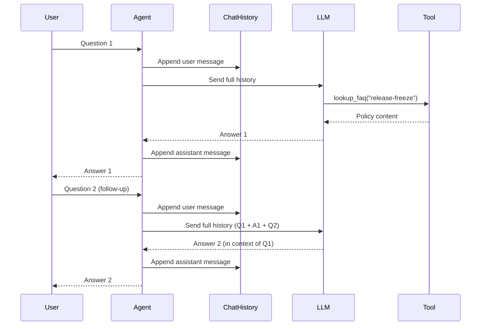
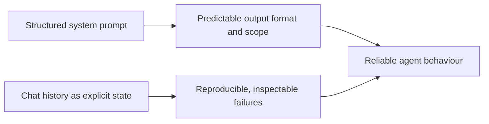

# Controlling Agent Behaviour — Prompt Engineering and State

## Recap and what changes in this post

In [post 1](../blog-01-from-llms-to-agents/blog.md) we built a minimal policy assistant. It could answer a single question, call a tool to retrieve a policy document, and return a grounded response. The core loop — plan, act, observe — was in place.

But there was a problem you would notice almost immediately in real use: ask the agent two questions in the same session and it forgets the first one. Change the system prompt slightly and the tone, scope, and format of answers shifts unpredictably. The agent was functional but not yet **controllable**.

This post fixes that. We will cover two things:

1. **Prompt engineering** — treating the system prompt as a precise control mechanism, not a free-form description.
2. **Explicit state** — persisting conversation history so the agent reasons across turns instead of answering each question in isolation.

The code builds directly on the blog 1 example. The same FAQ tool, the same Azure OpenAI backend — but the agent will now handle multi-turn conversations predictably.

---

## Why prompts are control mechanisms, not text generation

The most common mistake when building agents is writing the system prompt like a chat message — a friendly paragraph describing what the agent "is". That works in demos, but it does not hold up when:

- You need consistent output format (so downstream systems can parse responses).
- You need the agent to stay inside a defined scope (so it does not hallucinate answers outside its knowledge).
- You need to reproduce a failure and understand *why* the agent responded the way it did.

A better mental model: **the system prompt is code**. It specifies:

- **Persona** — who the agent is and the tone it uses.
- **Scope** — what it can and cannot answer.
- **Behaviour rules** — how it handles uncertainty, when to call a tool, what format to use.
- **Output contract** — the structure the caller can rely on.

When the prompt is structured this way, behaviour becomes predictable. Changing one section changes exactly one thing, and you can test that change in isolation — just like a code change.

### The anatomy of a structured system prompt

```
[PERSONA]
Who the agent is and the tone it uses.

[SCOPE]
What topics are in and out of bounds.

[TOOL USAGE RULES]
When and how to call available tools.

[RESPONSE FORMAT]
The structure and length constraints on answers.

[BEHAVIOUR UNDER UNCERTAINTY]
What to do when the answer is not known or not in scope.
```

Below we will look at a concrete before-and-after comparison using our policy assistant.

---

## Before: a vague prompt

```python
instructions = """
You are a helpful internal knowledge assistant.
If you need a policy, call the lookup_faq tool.

You can answer questions about:
- Release freeze timelines and what is allowed during the freeze
- SEV1 incident handling, roles, escalation, and communication
"""
```

This works for demos. In practice, it leaves several decisions to the model on every call:

- Should it answer questions outside the listed topics?
- Should it summarise or cite verbatim?
- What should it say if the policy document does not cover the question?
- Should it ask clarifying questions or make assumptions?

Because those decisions are implicit, the answers vary. The same question asked twice may produce different structures, different caveats, different lengths.

---

## After: a structured prompt

```python
instructions = """
## PERSONA
You are the internal policy assistant for an engineering team.
You are precise, concise, and cite the specific policy that informs your answer.
You do not use filler phrases like "Great question!" or "Certainly!".

## SCOPE
You answer questions on these topics only:
- Release freeze: timing, allowed changes, exceptions, approvals, rollback.
- SEV1 incidents: definition, roles, timelines, escalation, post-incident requirements.

If a question is outside this scope, respond exactly:
  "I can only answer questions about release freeze and SEV1 incidents."

## TOOL USAGE RULES
- Always call lookup_faq before answering a policy question.
- Call it with the key "release-freeze" for release freeze questions.
- Call it with the key "incident-sev1" for SEV1 questions.
- Do not answer from memory; use only what the tool returns.

## RESPONSE FORMAT
- Answer in plain prose, 3–5 sentences maximum.
- If the answer involves a list of steps or roles, use a numbered or bulleted list.
- End every answer with: "Source: <policy key used>"

## BEHAVIOUR UNDER UNCERTAINTY
- If the tool returns no content for a key, respond: "Policy not found. Please check with your Release Manager."
- If the user's question is ambiguous, ask one clarifying question before calling the tool.
"""
```

Now every section controls exactly one behaviour. You can change the response format without touching the tool usage rules. You can narrow the scope without changing the persona. Each section is independently testable.

---

## Why state matters

The blog 1 agent was **stateless**: each call to `ask_agent()` was a fresh conversation. The agent had no memory of what the user asked a moment ago.

This is a problem for any realistic workflow. A real policy conversation might go:

```
User:  When does the release freeze start?
Agent: The freeze begins 48 hours before the release window.

User:  And what changes are allowed during that period?
Agent: [Needs to know we are still talking about the release freeze]

User:  Who approves exceptions?
Agent: [Needs to know the context of "exceptions" from the previous turn]
```

Without state, the second and third questions arrive at the LLM without context. The model has to guess what "that period" refers to. It may guess correctly most of the time — but correctness by inference is not the same as correctness by design.

**Explicit state** solves this by passing the full conversation history to the LLM on every turn, so each new question is answered in the context of everything that came before.

---

## How conversation state works in Semantic Kernel

Semantic Kernel provides a `ChatHistory` object that accumulates messages across turns. Instead of calling `get_response(messages=question)` with a bare string, we pass the whole history and append each new exchange to it.



The `ChatHistory` object is the agent's **working memory** for the session. It is simple, inspectable, and deterministic — you can print it at any point to understand exactly what the LLM sees.

---

## State vs memory — a useful distinction

State and memory are often used interchangeably, but it helps to distinguish them:

| | **State (this post)** | **Memory (future posts)** |
|---|---|---|
| **Scope** | Within a single session | Across sessions |
| **Storage** | In-process (`ChatHistory`) | External (vector store, database) |
| **Typical use** | Multi-turn conversation context | Remembering user preferences, past incidents |
| **Complexity** | Low | Medium–high |

This post covers in-session state. Cross-session memory (with retrieval) is the topic of post 3.

---

## What predictable and debuggable means in practice

With a structured prompt and explicit state, you gain two properties that matter for production:

**Predictable:** Given the same conversation history and the same policy documents, the agent produces the same category of response. The format, scope, and citation pattern are consistent. Downstream systems (dashboards, notifications, logs) can parse the output reliably.

**Debuggable:** When the agent gives a wrong or unexpected answer, you can inspect exactly what it received: the system prompt, the conversation history, and the tool output. There is no hidden state. The failure is reproducible because the input is fully known.



---

## Updated agent (SK + Azure OpenAI)

The changes from blog 1 are:

1. The system prompt is replaced with the structured version above.
2. A `ChatHistory` object is created per session and passed to `invoke()` instead of `get_response()`.
3. The API now accepts an optional `session_id` so each user gets their own history.
4. The Streamlit UI becomes a proper multi-turn chat interface.

### Full example

**agent.py**

```python
import os
import asyncio
from pathlib import Path
from typing import Optional

from semantic_kernel.agents import ChatCompletionAgent
from semantic_kernel.connectors.ai.open_ai import AzureChatCompletion, OpenAIChatPromptExecutionSettings
from semantic_kernel.contents import ChatHistory
from semantic_kernel.functions import kernel_function, KernelArguments

# --- Configuration ---
from dotenv import load_dotenv
load_dotenv()

AZURE_OPENAI_ENDPOINT = os.environ["AZURE_OPENAI_ENDPOINT"]
AZURE_OPENAI_KEY = os.environ["AZURE_OPENAI_API_KEY"]
AZURE_OPENAI_DEPLOYMENT = os.environ["AZURE_OPENAI_DEPLOYMENT"]

FAQ_DIR = Path("../data/faq_docs")

def load_faq_docs() -> dict[str, str]:
    """Load each .txt file into a {key: content} dictionary."""
    docs = {}
    for path in FAQ_DIR.glob("*.txt"):
        docs[path.stem] = path.read_text(encoding="utf-8").strip()
    return docs

FAQ = load_faq_docs()  # Loaded once at startup

# --- Tool definition ---
class InternalFaqTool:
    @kernel_function(
        name="lookup_faq",
        description="Lookup an internal policy document by key. "
                    "Valid keys: 'release-freeze', 'incident-sev1'.",
    )
    def lookup_faq(self, key: str) -> str:
        return FAQ.get(key, "Policy not found. Please check with your Release Manager.")

# --- Structured system prompt ---
# Each section controls exactly one behaviour.
# Change one section without touching the others to isolate the effect.
INSTRUCTIONS = """
## PERSONA
You are the internal policy assistant for an engineering team.
You are precise, concise, and cite the specific policy that informs your answer.
You do not use filler phrases like "Great question!" or "Certainly!".

## SCOPE
You answer questions on these topics only:
- Release freeze: timing, allowed changes, exceptions, approvals, rollback.
- SEV1 incidents: definition, roles, timelines, escalation, post-incident requirements.

If a question is outside this scope, respond exactly:
  "I can only answer questions about release freeze and SEV1 incidents."

## TOOL USAGE RULES
- Always call lookup_faq before answering a policy question.
- Call it with the key "release-freeze" for release freeze questions.
- Call it with the key "incident-sev1" for SEV1 questions.
- Do not answer from memory; use only what the tool returns.

## RESPONSE FORMAT
- Answer in plain prose, 3-5 sentences maximum.
- If the answer involves a list of steps or roles, use a numbered or bulleted list.
- End every answer with: "Source: <policy key used>"

## BEHAVIOUR UNDER UNCERTAINTY
- If the tool returns no content for a key, respond: "Policy not found. Please check with your Release Manager."
- If the user's question is ambiguous, ask one clarifying question before calling the tool.
"""

# --- LLM parameters ---
SETTINGS = OpenAIChatPromptExecutionSettings(
    temperature=0.1,  # Very low: we want highly consistent, factual responses
    max_tokens=600,
    tool_choice="auto",
)

# --- Agent assembly ---
_agent = ChatCompletionAgent(
    service=AzureChatCompletion(       # LLM: connects to Azure OpenAI
        deployment_name=AZURE_OPENAI_DEPLOYMENT,
        endpoint=AZURE_OPENAI_ENDPOINT,
        api_key=AZURE_OPENAI_KEY,
    ),
    name="Policy-Assistant",
    instructions=INSTRUCTIONS,
    plugins=[InternalFaqTool()],
    arguments=KernelArguments(SETTINGS),
)

# --- In-process session store ---
# Maps session_id -> ChatHistory.
# In production this would be an external store (Redis, database, etc.).
_sessions: dict[str, ChatHistory] = {}

def get_or_create_history(session_id: str) -> ChatHistory:
    """Return the existing ChatHistory for a session, or create a new one."""
    if session_id not in _sessions:
        _sessions[session_id] = ChatHistory()
    return _sessions[session_id]

# --- Agent loop entry point (stateful) ---
# The full ChatHistory is passed to invoke() on every call so the LLM
# sees the complete conversation context, not just the latest question.
async def ask_agent(question: str, session_id: str = "default") -> str:
    history = get_or_create_history(session_id)
    history.add_user_message(question)   # Append the new question to history

    response_text = ""
    # invoke() runs the plan -> act -> observe loop and streams response chunks
    async for chunk in _agent.invoke(history):
        response_text += str(chunk.content)

    history.add_assistant_message(response_text)  # Persist the answer in history
    return response_text

def reset_session(session_id: str = "default") -> None:
    """Clear the conversation history for a session."""
    _sessions.pop(session_id, None)

async def main() -> None:
    """Interactive CLI loop — type 'reset' to clear history, 'quit' to exit."""
    session_id = "cli-session"
    print("Policy Assistant (type 'reset' to clear history, 'quit' to exit)\n")
    while True:
        user_input = input("You: ").strip()
        if user_input.lower() == "quit":
            break
        if user_input.lower() == "reset":
            reset_session(session_id)
            print("[Session history cleared]\n")
            continue
        answer = await ask_agent(user_input, session_id=session_id)
        print(f"Agent: {answer}\n")

if __name__ == "__main__":
    asyncio.run(main())
```

---

**api.py**

```python
from fastapi import FastAPI
from pydantic import BaseModel

from agent import ask_agent, reset_session  # Stateful agent with session support

app = FastAPI()

# --- Request/response schemas ---
class Query(BaseModel):
    question: str
    session_id: str = "default"  # Each client passes its own session ID for isolated history

class ResetRequest(BaseModel):
    session_id: str = "default"

# POST /ask — routes the question + session_id to the stateful agent.
# The agent appends to (or starts) the ChatHistory for that session_id,
# so follow-up questions retain context from earlier in the conversation.
@app.post("/ask")
async def ask(query: Query):
    answer = await ask_agent(query.question, session_id=query.session_id)
    return {"answer": answer, "session_id": query.session_id}

# POST /reset — clears the conversation history for a session.
# Call this when the user starts a new topic or explicitly resets the chat.
@app.post("/reset")
async def reset(req: ResetRequest):
    reset_session(req.session_id)
    return {"status": "reset", "session_id": req.session_id}
```

---

**streamlit.py**

```python
import uuid
import requests
import streamlit as st

API_URL = "http://127.0.0.1:8000"

st.title("Policy Assistant")
st.caption("Multi-turn — ask follow-up questions and the agent remembers the context.")

# Assign a unique session ID per browser tab so each user has isolated history.
if "session_id" not in st.session_state:
    st.session_state.session_id = str(uuid.uuid4())

# Store the displayed conversation locally so we can render the full chat history.
if "messages" not in st.session_state:
    st.session_state.messages = []

# Render all previous messages
for msg in st.session_state.messages:
    with st.chat_message(msg["role"]):
        st.write(msg["content"])

# Chat input — Streamlit re-runs on each submission
question = st.chat_input("Ask a policy question...")

if question:
    # Show the user's message immediately
    st.session_state.messages.append({"role": "user", "content": question})
    with st.chat_message("user"):
        st.write(question)

    # Send to backend — include session_id so the agent uses the right history
    response = requests.post(
        f"{API_URL}/ask",
        json={"question": question, "session_id": st.session_state.session_id},
    )
    if response.ok:
        answer = response.json()["answer"]
    else:
        answer = "Request failed. Is the API server running?"

    # Show the agent's response and persist it
    st.session_state.messages.append({"role": "assistant", "content": answer})
    with st.chat_message("assistant"):
        st.write(answer)

# Sidebar: reset button clears both the local display and the server-side history
with st.sidebar:
    st.header("Session")
    st.write(f"Session ID: `{st.session_state.session_id[:8]}...`")
    if st.button("Reset conversation"):
        requests.post(
            f"{API_URL}/reset",
            json={"session_id": st.session_state.session_id},
        )
        st.session_state.messages = []
        st.rerun()
```

---

## What changed and why

| | Blog 1 | Blog 2 |
|---|---|---|
| **System prompt** | Unstructured paragraph | Structured sections (persona, scope, rules, format) |
| **Agent call** | `get_response(messages=question)` — stateless | `invoke(history)` — full conversation history |
| **Session state** | None | `ChatHistory` per `session_id` |
| **API** | `/ask` with bare question | `/ask` with `session_id`; `/reset` endpoint added |
| **UI** | Single text input | Multi-turn chat with session reset |

The agent is now **controllable** (the prompt defines exactly what it does) and **stateful** (it reasons across turns). It still uses the same FAQ tool and the same Azure OpenAI backend as blog 1 — the architecture did not change, only the quality of the control and memory layers.

---

## Example run

```bash
# 1) Create and activate a virtual environment (if not already done)
python -m venv .venv
.venv\Scripts\activate          # Windows
# source .venv/bin/activate     # macOS / Linux

# 2) Install dependencies
pip install -r requirements.txt

# 3) Set up credentials (copy the template and fill in your values)
cp .env.template .env

# 4) Run the agent interactively in the CLI (demonstrates multi-turn state)
python agent.py
# Try: "When does the release freeze start?"
# Then: "What changes are allowed during that period?"
# Then: "Who approves exceptions?"

# 5) Start the API server
uvicorn api:app --reload

# 6) Test a multi-turn conversation via the API
curl -X POST http://127.0.0.1:8000/ask \
  -H "Content-Type: application/json" \
  -d "{\"question\": \"When does the release freeze start?\", \"session_id\": \"test-session\"}"

curl -X POST http://127.0.0.1:8000/ask \
  -H "Content-Type: application/json" \
  -d "{\"question\": \"What is allowed during that period?\", \"session_id\": \"test-session\"}"

# 7) Run the Streamlit chat UI
streamlit run streamlit.py
```

---

## Observing prompt impact — a quick experiment

The fastest way to build intuition about prompt engineering is to change one section at a time and observe the effect:

1. **Remove the SCOPE section** — ask a question outside the policy domain and watch the agent answer anyway.
2. **Remove the RESPONSE FORMAT section** — answers become inconsistent in length and structure.
3. **Change `temperature` from `0.1` to `0.8`** — the same question now produces noticeably different answers on repeated runs.
4. **Print the `ChatHistory` object after two turns** — see exactly what the LLM received as context.

Each of these experiments takes less than a minute and builds a much clearer mental model than reading documentation.

---

**What's next:** post 3 adds **retrieval-augmented generation (RAG)** — loading knowledge from a real document corpus rather than a small FAQ dictionary, so the agent can answer questions across a much larger knowledge base without stuffing everything into the context window.

### Closing note
The two concepts in this post — structured prompts and explicit state — are the foundation of every reliable agent you will build. RAG, tools, multi-agent coordination all sit on top of them. Invest time here and the rest of the series will feel systematic rather than magical.
