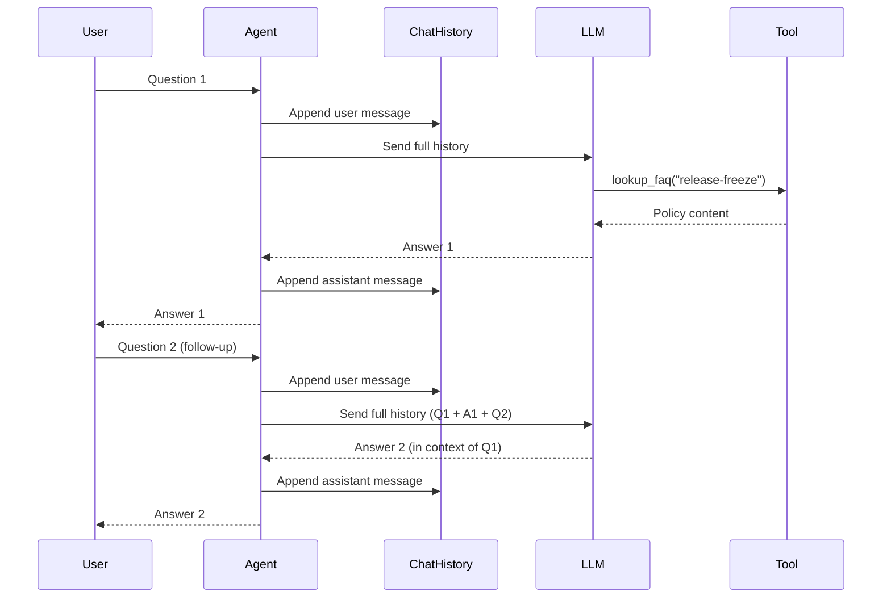
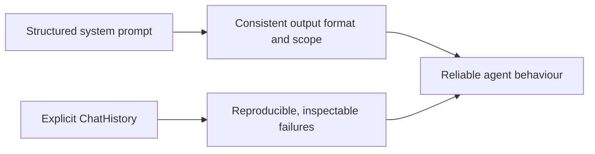

# Controlling Agent Behaviour — Prompt Engineering and Explicit State

## Executive summary

- The system prompt is not descriptive text — it is the agent's behavioural specification. How it is written determines how consistently the agent performs in production.
- Unstructured prompts introduce variability in output format, scope enforcement, and fallback behaviour. That variability compounds across multi-turn conversations and downstream integrations.
- Explicit conversation state — passing the full exchange history to the model on every call — is the mechanism that enables coherent multi-turn reasoning. Without it, each response is context-blind.
- The two controls introduced in this post (structured prompt + explicit state) are the foundation that every subsequent capability in this series depends on: retrieval, tool orchestration, and multi-agent coordination all require an agent that behaves predictably.
- In regulated or audited environments, both controls directly support compliance: a structured prompt makes scope and fallback behaviour auditable; explicit state makes the agent's reasoning reproducible.
- This post advances the agent from Level 1 (prompt-based assistant) to Level 3 (stateful workflow agent) on the Enterprise AI Agent Maturity Model.

---

## Strategic context

The previous post built the minimum viable agent: a single tool, a readable prompt, a one-turn call. That was sufficient to demonstrate the plan → act → observe loop. It is not sufficient for sustained use.

Two failure patterns appear quickly once an agent moves from demonstration to regular use.

**Failure pattern 1: prompt variability.** A loosely worded prompt leaves decisions to the model on every call — whether to answer out-of-scope questions, how to structure the response, what to say when the policy document doesn't cover the question. Because those decisions are implicit, the model resolves them differently depending on phrasing, temperature, and context. The same question asked twice may produce different formats, different caveats, different lengths. Downstream systems that parse agent output — dashboards, ticketing integrations, automated workflows — cannot rely on a structure that shifts.

**Failure pattern 2: stateless reasoning.** The previous post's agent made single-turn calls. Each call passed a bare string with no conversation history. The model had no knowledge of what came before. In a multi-turn exchange, this produces responses that are disconnected from earlier context:

```
User:  When does the release freeze start?
Agent: The freeze begins 48 hours before the release window.

User:  And what changes are allowed during that period?
Agent: [No context — "that period" is unresolved]

User:  Who approves exceptions?
Agent: [No context — "exceptions" to what is unresolved]
```

The model may infer the correct context from wording alone in simple cases. In longer exchanges, under ambiguous phrasing, or when the conversation crosses topic boundaries, inference-based correctness fails. Design-based correctness — passing the full history explicitly — does not.

Both failures are architectural, not model quality issues. A more capable model does not reliably fix either. Structured prompting and explicit state do.

---

## Conceptual model

### The system prompt as behavioural specification

In the previous post, the system prompt was a description: who the agent is and what it can help with. That framing is correct as a starting point. In production, the prompt needs to function as a **behavioural specification** — the agent's configuration file. Like a configuration file, it defines what the agent does and does not do, and callers depend on it being consistent.

A reliable pattern is to divide the prompt into named sections, each with a single responsibility:

```
[PERSONA]       — who the agent is and the tone it uses
[SCOPE]         — what topics are in and out of bounds
[TOOL USAGE]    — when and how to call available tools
[RESPONSE FORMAT] — structure and length constraints on answers
[UNCERTAINTY]   — what to do when the answer is unknown or out of scope
```

Each section is independently testable. Change the response format without touching the tool usage rules. Narrow the scope without changing the persona. The prompt becomes maintainable in the same way code is.

### Explicit conversation state

**Explicit state** means passing the full conversation history — every prior user message and agent response — to the model on every call. The model then reasons in context rather than in isolation.

In Semantic Kernel, this is done via a `ChatHistory` object. One `ChatHistory` is created per session. Every exchange is appended to it. On each new call, the entire object is passed to the model.


```mermaid
sequenceDiagram
    participant User
    participant Agent
    participant ChatHistory
    participant LLM
    participant Tool

    User->>Agent: Question 1
    Agent->>ChatHistory: Append user message
    Agent->>LLM: Send full history
    LLM->>Tool: lookup_faq("release-freeze")
    Tool-->>LLM: Policy content
    LLM-->>Agent: Answer 1
    Agent->>ChatHistory: Append assistant message
    Agent-->>User: Answer 1

    User->>Agent: Question 2 (follow-up)
    Agent->>ChatHistory: Append user message
    Agent->>LLM: Send full history (Q1 + A1 + Q2)
    LLM-->>Agent: Answer 2 (in context of Q1)
    Agent->>ChatHistory: Append assistant message
    Agent-->>User: Answer 2
```

The `ChatHistory` object is the agent's working memory for the session. It is inspectable at any point — print it to see exactly what the model received, which makes failures reproducible.

### State vs. memory — a useful distinction

These two terms are often conflated. They are different controls with different scopes:

| | **State (this post)** | **Memory (upcoming posts)** |
|---|---|---|
| **Scope** | Within a single session | Across sessions |
| **Storage** | In-process (`ChatHistory`) | External (vector store, database) |
| **Typical use** | Multi-turn conversation context | Remembering past incidents, user preferences |
| **Complexity** | Low | Medium–high |

This post covers in-session state. Cross-session memory — retrieving relevant history from an external store — is covered later in the series.

### What predictable and debuggable means in practice

With a structured prompt and explicit state, two properties follow that matter for production:

**Predictable:** Given the same conversation history and the same policy documents, the agent produces the same category of response. The format, scope enforcement, and citation pattern are consistent. Downstream systems can parse the output reliably.

**Debuggable:** When the agent gives an unexpected answer, you can inspect exactly what it received: the system prompt, the full conversation history, and the tool output. There is no hidden state. The failure is reproducible because the input is fully known.


```mermaid
flowchart LR
    SP[Structured system prompt] --> Predictable[Consistent output format and scope]
    CH[Explicit ChatHistory] --> Debuggable[Reproducible, inspectable failures]
    Predictable --> Reliable[Reliable agent behaviour]
    Debuggable --> Reliable
```

Predictability and debuggability are not properties of the model — they are properties of the architecture around it. The diagram above shows the direct dependency: structured prompt produces predictable output; explicit history produces debuggable failures. Both feed into reliable behaviour.

---

## When this is not needed

A structured prompt and explicit state add code and operational complexity. There are cases where neither is justified:

- **Single-turn, single-purpose tools** — a script that answers one fixed question and exits does not benefit from conversation history. A bare string call is correct.
- **Internal prototypes and exploratory work** — when the goal is to test whether an LLM can reason over a dataset at all, prompt structure and state management are premature. Build them when the behaviour needs to be repeatable.
- **Batch processing pipelines** — agents that process records in isolation, with no follow-up questions, do not need session state.

Add structure when behaviour needs to be consistent, auditable, or multi-turn. Do not add it because it seems more complete.

---

## Code implementation

The previous post established the agent's core: a tool, a prompt, an LLM call. This post makes two targeted changes to that foundation — a restructured system prompt and a stateful invocation path — and extends the API and UI to support multi-turn sessions.

Four code patterns appear in this update:

1. **Structured system prompt** — replaces the readable description with a specification divided into named sections.
2. **In-process session store** — a `dict[str, ChatHistory]` that maps session IDs to conversation histories. Each user gets an isolated context.
3. **Stateful agent entry point** — `ask_agent()` now appends to and reads from `ChatHistory` rather than passing a bare string.
4. **Session management endpoints** — the API gains a `session_id` field and a `/reset` endpoint; the UI gains a chat interface and a reset button.

The scenario is the same internal policy assistant from the previous post. The FAQ tool and Azure OpenAI backend are unchanged.

### Full example

**agent.py**

```python
import os
import asyncio
from pathlib import Path

from semantic_kernel.agents import ChatCompletionAgent
from semantic_kernel.connectors.ai.open_ai import AzureChatCompletion, OpenAIChatPromptExecutionSettings
from semantic_kernel.contents import ChatHistory
from semantic_kernel.functions import kernel_function, KernelArguments

# --- Configuration ---
# Load credentials from a .env file so secrets never appear in source code.
# Falls back to real environment variables if .env is absent (e.g. in CI/CD).
from dotenv import load_dotenv
load_dotenv()

AZURE_OPENAI_ENDPOINT = os.environ["AZURE_OPENAI_ENDPOINT"]
AZURE_OPENAI_KEY = os.environ["AZURE_OPENAI_API_KEY"]
AZURE_OPENAI_DEPLOYMENT = os.environ["AZURE_OPENAI_DEPLOYMENT"]

FAQ_DIR = Path("../data/faq_docs")

def load_faq_docs() -> dict[str, str]:
    """Load each .txt file into a {key: content} dictionary."""
    docs = {}
    for path in FAQ_DIR.glob("*.txt"):
        docs[path.stem] = path.read_text(encoding="utf-8").strip()
    return docs

FAQ = load_faq_docs()  # Loaded once at startup; acts as the agent's private knowledge base

# --- Tool definition ---
# lookup_faq is the only action the agent is allowed to take.
# The description tells the LLM exactly when to call it and which keys are valid.
class InternalFaqTool:
    @kernel_function(
        name="lookup_faq",
        description="Lookup an internal policy document by key. "
                    "Valid keys: 'release-freeze', 'incident-sev1'.",
    )
    def lookup_faq(self, key: str) -> str:
        return FAQ.get(key, "Policy not found. Please check with your Release Manager.")

# --- Structured system prompt ---
# Organised into named sections so each behaviour can be changed independently.
# Treat this like source code: one section = one responsibility.
INSTRUCTIONS = """
## PERSONA
You are the internal policy assistant for an engineering team.
You are precise, concise, and cite the specific policy that informs your answer.
You do not use filler phrases like "Great question!" or "Certainly!".

## SCOPE
You answer questions on these topics only:
- Release freeze: timing, allowed changes, exceptions, approvals, rollback.
- SEV1 incidents: definition, roles, timelines, escalation, post-incident requirements.

If a question is outside this scope, respond exactly:
  "I can only answer questions about release freeze and SEV1 incidents."

## TOOL USAGE RULES
- Always call lookup_faq before answering a policy question.
- Call it with the key "release-freeze" for release freeze questions.
- Call it with the key "incident-sev1" for SEV1 questions.
- Do not answer from memory; use only what the tool returns.

## RESPONSE FORMAT
- Answer in plain prose, 3-5 sentences maximum.
- If the answer involves a list of steps or roles, use a numbered or bulleted list.
- End every answer with: "Source: <policy key used>"

## BEHAVIOUR UNDER UNCERTAINTY
- If the tool returns no content for a key, respond: "Policy not found. Please check with your Release Manager."
- If the user's question is ambiguous, ask one clarifying question before calling the tool.
"""

# --- LLM parameters ---
# Temperature 0.1: maximise consistency across repeated runs.
# Raising it above ~0.4 will make answers noticeably less predictable.
SETTINGS = OpenAIChatPromptExecutionSettings(
    temperature=0.1,
    max_tokens=600,
    tool_choice="auto",  # Let the LLM decide when to call the tool
)

# --- Agent assembly ---
# Wires together the LLM service, structured prompt, tool, and call settings.
_agent = ChatCompletionAgent(
    service=AzureChatCompletion(       # LLM: connects to Azure OpenAI
        deployment_name=AZURE_OPENAI_DEPLOYMENT,
        endpoint=AZURE_OPENAI_ENDPOINT,
        api_key=AZURE_OPENAI_KEY,
    ),
    name="Policy-Assistant",
    instructions=INSTRUCTIONS,
    plugins=[InternalFaqTool()],
    arguments=KernelArguments(SETTINGS),
)

# --- In-process session store ---
# Maps session_id -> ChatHistory so each user keeps their own conversation context.
# In production, replace this dict with an external store (Redis, database, etc.)
# so history survives server restarts and scales across multiple processes.
_sessions: dict[str, ChatHistory] = {}

def get_or_create_history(session_id: str) -> ChatHistory:
    """Return the existing ChatHistory for a session, or create a new one."""
    if session_id not in _sessions:
        _sessions[session_id] = ChatHistory()
    return _sessions[session_id]

# --- Stateful agent entry point ---
# The full ChatHistory is passed to invoke() on every call.
# The LLM sees the complete conversation — not just the latest question —
# so follow-up questions like "what about exceptions?" resolve correctly.
async def ask_agent(question: str, session_id: str = "default") -> str:
    history = get_or_create_history(session_id)
    history.add_user_message(question)        # Append new question to history

    response_text = ""
    # invoke() runs the plan -> act -> observe loop; tool calls happen inside here
    async for chunk in _agent.invoke(history):
        response_text += str(chunk.content)

    history.add_assistant_message(response_text)  # Persist the answer
    return response_text

def reset_session(session_id: str = "default") -> None:
    """Clear the conversation history for a session."""
    _sessions.pop(session_id, None)

async def main() -> None:
    """Interactive CLI loop — demonstrates multi-turn state.
    Type 'reset' to clear history, 'quit' to exit.
    """
    session_id = "cli-session"
    print("Policy Assistant (type 'reset' to clear history, 'quit' to exit)\n")
    while True:
        user_input = input("You: ").strip()
        if not user_input:
            continue
        if user_input.lower() == "quit":
            break
        if user_input.lower() == "reset":
            reset_session(session_id)
            print("[Session history cleared]\n")
            continue
        answer = await ask_agent(user_input, session_id=session_id)
        print(f"Agent: {answer}\n")

if __name__ == "__main__":
    asyncio.run(main())
```

The `get_or_create_history()` function is the session store's public interface — every call that needs history goes through it. `ask_agent()` appends the user message before calling the model and the assistant message after, so the history is always complete regardless of how the function is called.

The API and UI layers extend the same session model across HTTP.

**api.py**

```python
from fastapi import FastAPI
from pydantic import BaseModel

from agent import ask_agent, reset_session  # Stateful agent with per-session ChatHistory

app = FastAPI()

# --- Request/response schemas ---

class Query(BaseModel):
    question: str
    session_id: str = "default"  # Each client passes its own session ID for isolated history

class ResetRequest(BaseModel):
    session_id: str = "default"

# POST /ask — routes the question + session_id to the stateful agent.
# The agent appends to (or starts) the ChatHistory for that session_id,
# so follow-up questions retain full context from earlier in the conversation.
@app.post("/ask")
async def ask(query: Query):
    answer = await ask_agent(query.question, session_id=query.session_id)
    return {"answer": answer, "session_id": query.session_id}

# POST /reset — clears the ChatHistory for a session.
# Call this when the user explicitly starts a new topic or resets the chat.
@app.post("/reset")
async def reset(req: ResetRequest):
    reset_session(req.session_id)
    return {"status": "reset", "session_id": req.session_id}
```

**streamlit.py**

```python
import uuid
import requests
import streamlit as st

API_URL = "http://127.0.0.1:8000"

st.title("Policy Assistant")
st.caption("Multi-turn — ask follow-up questions and the agent remembers the context.")

# Assign a unique session ID per browser tab so each user has isolated history.
# uuid4() is generated once per session and stored in Streamlit's session_state.
if "session_id" not in st.session_state:
    st.session_state.session_id = str(uuid.uuid4())

# Local message list mirrors what is displayed in the chat window.
# The authoritative conversation history lives server-side in ChatHistory.
if "messages" not in st.session_state:
    st.session_state.messages = []

# Render the full conversation so far
for msg in st.session_state.messages:
    with st.chat_message(msg["role"]):
        st.write(msg["content"])

# st.chat_input renders a persistent input box at the bottom of the page.
# Streamlit re-runs the entire script each time the user submits a message.
question = st.chat_input("Ask a policy question...")

if question:
    # Display the user's message immediately (before waiting for the API)
    st.session_state.messages.append({"role": "user", "content": question})
    with st.chat_message("user"):
        st.write(question)

    # Send to the FastAPI backend — session_id ensures the agent uses the right history
    response = requests.post(
        f"{API_URL}/ask",
        json={"question": question, "session_id": st.session_state.session_id},
    )
    if response.ok:
        answer = response.json()["answer"]  # LLM response, grounded by the policy tool
    else:
        answer = "Request failed. Is the API server running?"

    # Persist and display the agent's response
    st.session_state.messages.append({"role": "assistant", "content": answer})
    with st.chat_message("assistant"):
        st.write(answer)

# Sidebar: reset button clears both the local display and the server-side ChatHistory
with st.sidebar:
    st.header("Session")
    st.write(f"Session ID: `{st.session_state.session_id[:8]}...`")
    if st.button("Reset conversation"):
        # Clear server-side ChatHistory for this session
        requests.post(
            f"{API_URL}/reset",
            json={"session_id": st.session_state.session_id},
        )
        # Clear local display
        st.session_state.messages = []
        st.rerun()
```

---

## Example run

```bash
# 1) Set up the virtual environment (skip if carried over from the previous post)
python -m venv .venv
.venv\Scripts\activate          # Windows
# source .venv/bin/activate     # macOS / Linux

# 2) Install dependencies
pip install -r requirements.txt

# 3) Set up credentials (skip if .env already populated from the previous post)
cp .env.template .env           # Then fill in your Azure OpenAI values

# 4) Run the agent in the CLI — try a multi-turn conversation
python agent.py
# Try: "When does the release freeze start?"
# Then: "What changes are allowed during that period?"
# Then: "Who approves exceptions?"
# Then type 'reset' and ask again — notice the agent loses the prior context

# 5) Start the API server
uvicorn api:app --reload

# 6) Test multi-turn via the API (same session_id links the turns)
curl -X POST http://127.0.0.1:8000/ask \
  -H "Content-Type: application/json" \
  -d "{\"question\": \"When does the release freeze start?\", \"session_id\": \"test-session\"}"

curl -X POST http://127.0.0.1:8000/ask \
  -H "Content-Type: application/json" \
  -d "{\"question\": \"What is allowed during that period?\", \"session_id\": \"test-session\"}"

# 7) Run the Streamlit chat UI
streamlit run streamlit.py
```

---

## Enterprise considerations

### Security

The in-process session store (`dict[str, ChatHistory]`) holds conversation history in memory. In production, this has two risks: history is lost on server restart, and a memory leak is possible if sessions are never explicitly cleared. Replace the in-process dict with an external store (Redis, Azure Cache, a database) with a TTL on session records.

The `session_id` in the API is currently caller-supplied and unvalidated. Any caller that knows or guesses a session ID can read or reset another user's history. In production, bind session IDs to authenticated identities — do not treat them as opaque tokens.

### Governance

The SCOPE section of the structured prompt is the primary governance control in this agent. It defines what the agent will and will not answer. That boundary should be reviewed by whoever owns the policy domain, not just the engineering team that writes it. Treat changes to the SCOPE section with the same review process as changes to policy documents themselves.

### Observability

The `ChatHistory` object is the agent's full reasoning context for a session. Log it (with appropriate PII controls) rather than just the final answer. When an agent gives an unexpected response, the history log tells you exactly what it received — system prompt, prior turns, tool output — which is the information needed to reproduce and diagnose the failure.

### Failure modes

The most common failure for structured prompts is **scope drift under paraphrasing**: a user asks a question that is technically outside the defined scope but phrased in a way that resembles an in-scope question. The model may answer it. The SCOPE section's "respond exactly" instruction reduces but does not eliminate this. Test the scope boundary explicitly — ask questions that are adjacent to but outside the defined topics and verify the refusal is consistent.

The most common failure for explicit state is **context window exhaustion**: long conversations eventually exceed the model's context limit. The current implementation does not truncate history. In production, implement a windowing strategy — keep the last N turns, or summarise older turns into a compressed representation — before the history exceeds the model's limit.

### Cost impact

Passing the full conversation history on every call means token usage grows linearly with conversation length. A 10-turn conversation costs roughly 10 times as many input tokens as a single turn. For high-volume deployments, monitor per-session token counts and enforce session length limits or implement history summarisation.

---

## Maturity model tie-in

The previous post moved the agent from Level 1 (prompt-based assistant) to Level 2 (tool-augmented agent) by adding a tool call. This post advances to **Level 3 — Stateful workflow agents**.

**Enterprise AI Agent Maturity Model:**

1. Level 1 — Prompt-based assistants
2. Level 2 — Tool-augmented agents
3. **Level 3 — Stateful workflow agents** ← this post
4. Level 4 — Multi-agent orchestration
5. Level 5 — Production-governed AI systems

Level 3 is the minimum viable architecture for an agent used in sustained, multi-turn enterprise workflows. Without explicit state and a structured prompt, agent behaviour is non-deterministic across sessions and cannot be audited or reliably integrated with other systems.

---

## Closing insight

The two controls introduced here — structured prompt and explicit conversation state — are not optimisations. They are the minimum conditions for an agent that behaves consistently enough to be useful in an enterprise context. Every capability that follows in this series (retrieval, orchestration, multi-agent coordination) assumes an agent that operates within defined boundaries and reasons coherently across turns. Skipping this foundation and moving directly to more complex patterns is the most common cause of agent systems that work in demos and fail in production.

The next architectural layer introduces retrieval-augmented generation (RAG): loading knowledge from a real document corpus so the agent can answer questions across a much larger knowledge base without stuffing everything into the context window. The patterns established here — structured prompt with explicit tool usage rules, explicit conversation history — are the integration surface that RAG attaches to.
