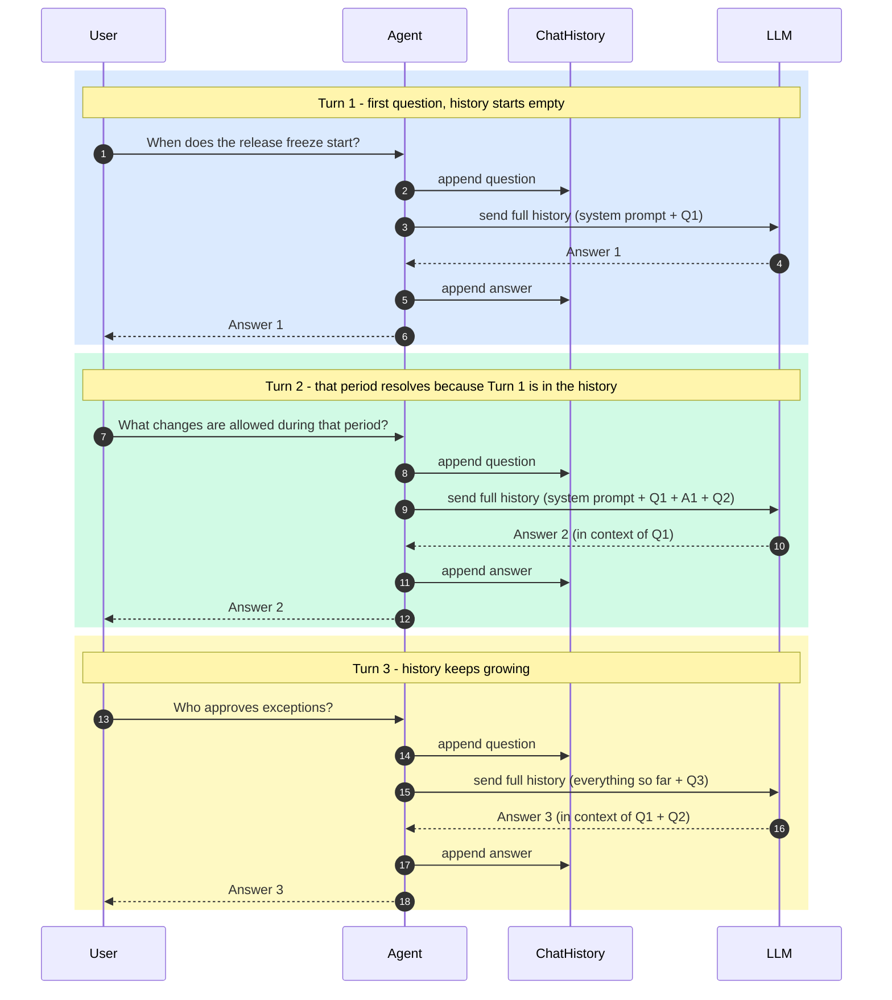
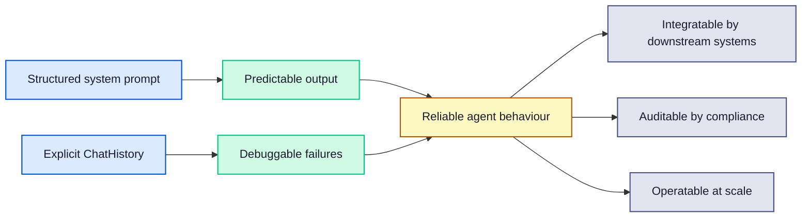

# Controlling Agent Behaviour — Prompt Engineering and Explicit State

In the previous post, we built a minimum viable agent: one tool, a readable prompt, a single-turn call. It was enough to prove the **plan → act → observe** loop and reach the right policy document. For a demo, that is sufficient. For anything sustained — an agent that real employees use, that downstream systems integrate with, that compliance has to sign off on — it is not.

The same question can produce a different format, tone, or level of detail each time the model is called. Follow-up questions like *"and what about exceptions?"* fail, because the agent has no memory of what was just asked. Neither gap is a model-quality problem — a more capable model does not reliably fix either. They are gaps in **how the agent is configured and how its context is managed**, and they are the difference between an agent that works in a sandbox and one that can be put in front of users.

In this post we close both gaps with two controls — a **structured system prompt** and **explicit conversation state** — using the same internal policy assistant as the running example. Together, they are what move an agent from "interesting prototype" to "predictable enough to integrate, audit, and operate."

## Why this matters before scaling

For anyone deciding how far to invest in agent-based systems, the question is rarely *can the LLM answer the question?* It is *will it answer the question the same way tomorrow, and can we explain what it did when something goes wrong?* Both gaps from the previous section feed directly into that question, and each one shows up as a distinct failure mode once a first-pass agent leaves the demo environment.

The first is what variability looks like in practice.

### Failure 1 — Inconsistent behaviour at scale

A loosely worded prompt leaves a long list of decisions to the model on every call: whether to answer an out-of-scope question, how to structure the response, what to say when the policy document is silent, whether to cite a source. Because those decisions are implicit, the model resolves them differently depending on phrasing, temperature, and recent context.

| What the same question might produce | Why it is a problem |
|---|---|
| Two-sentence prose answer one call, five-bullet list the next | Downstream systems that parse output cannot rely on shape |
| A polite answer to an out-of-scope question | Scope creep — the agent is being used for things it was not approved for |
| An answer with a source citation, then one without | Compliance and audit teams cannot trace responses to policy |
| Subtly different phrasing of the same policy | Erosion of trust in the agent over time |

None of these are *wrong*. They are *inconsistent*, and inconsistency is what makes an agent un-integratable and un-auditable. The second failure is what happens once you try to hold a conversation with it.

### Failure 2 — Stateless reasoning across turns

A single-turn agent treats every call as the first one. The model has no memory of what was just discussed, so anything that depends on prior context falls apart:

```
User:  When does the release freeze start?
Agent: The freeze begins 48 hours before the release window.

User:  And what changes are allowed during that period?
Agent: [No context — "that period" is unresolved]

User:  Who approves exceptions?
Agent: [No context — "exceptions" to what is unresolved]
```

The model can sometimes *infer* the context from wording. In longer exchanges, ambiguous phrasing, or when the conversation crosses topic boundaries, that inference fails. Real conversations do not survive on inference.

Both failures look like model problems but are architectural — and that distinction matters because the fix is not a more expensive model, it is a small change in design. Two design controls close both gaps. The next section introduces them at the level an architect would specify them; the implementation that lands them in code comes later.

## The two controls

Closing both failure modes requires two additions on top of the building blocks from the previous post:

**A structured system prompt** — the prompt is the agent's **configuration file**, not a description. It is divided into named sections, each with one responsibility, so behaviour becomes specific, testable, and reviewable by the people who own the underlying policy.

**Explicit conversation state** — instead of sending a bare string on every call, the full **conversation history** is passed to the model on every turn. The agent reasons in context, not in isolation, and that context is inspectable for audit and debugging.

These are small changes to the code. They are large changes to how the agent behaves — and to how defensibly the system can be operated. Each one is worth looking at in turn, starting with the prompt.

### The system prompt as a configuration file

A reliable pattern is to divide the prompt into named sections, each with a single responsibility:

```
[PERSONA]          — who the agent is and the tone it uses
[SCOPE]            — what topics are in and out of bounds
[TOOL USAGE]       — when and how to call available tools
[RESPONSE FORMAT]  — structure and length constraints on answers
[UNCERTAINTY]      — what to do when the answer is unknown
```

This is consistent with how the major model providers describe the role of the system prompt. Anthropic's prompt engineering guidance frames the system prompt as the place to *"establish consistent behavior patterns, define constraints and guardrails, and specify formatting requirements"* — distinct concerns that benefit from being addressed separately ([Anthropic, *Prompt engineering overview*](https://docs.anthropic.com/en/docs/build-with-claude/prompt-engineering/overview)). OpenAI's API reference describes the `system` role analogously, as the channel through which developers set the assistant's behaviour, scope, and output format for the rest of the conversation ([OpenAI, *Chat Completions API*](https://developers.openai.com/api/reference/chat-completions/overview)). Anthropic's own engineering write-up on production agents goes further and recommends *"simple, composable patterns rather than complex frameworks"* — a principle that applies as much to prompts as it does to orchestration ([Anthropic, *Building effective agents*](https://www.anthropic.com/research/building-effective-agents)).

Each section is independently changeable. Narrowing the agent's scope is a one-section edit, not a rewrite. Changing the response format does not touch the tool-usage rules. The prompt becomes maintainable in the same way code is — and reviewable by the right people: the SCOPE section can be signed off by the policy owner, the TOOL USAGE section by the engineering lead, the RESPONSE FORMAT section by whoever consumes the output downstream.

For governance and audit, this matters more than it looks. A monolithic prompt is opaque to anyone who did not write it. A sectioned prompt is a specification — what the agent is allowed to do, what it must refuse, and where its outputs come from — that non-engineers can read and approve.

The prompt handles consistency. State handles continuity, and the mechanism for that is the second control.

### Explicit state with `ChatHistory`

In Semantic Kernel, conversation state lives in a `ChatHistory` object. One per session. Every user message and every agent reply is appended to it. On every new call, the **entire** history is passed to the model — not just the latest question.

The clearest way to picture this is as a conversation transcript that grows turn by turn. On every call, the agent hands the model the **entire transcript so far** — not just the latest question. The shape is the same one described in the [OpenAI Chat Completions](https://developers.openai.com/api/reference/chat-completions/overview) and [Anthropic Messages](https://docs.anthropic.com/en/api/messages) API references: the system prompt at the top, followed by an alternating record of who said what.

The diagram below shows the same flow as a sequence, with each turn highlighted in its own band. Read it top to bottom — every turn follows the same three-step rhythm (**append → send the whole history → append the reply**), and what grows from turn to turn is the *amount* of history sent on the third arrow:


```mermaid
sequenceDiagram
    autonumber
    participant U as User
    participant A as Agent
    participant H as ChatHistory
    participant L as LLM

    rect rgb(219, 234, 254)
    Note over U,L: Turn 1 - first question, history starts empty
    U->>A: When does the release freeze start?
    A->>H: append question
    A->>L: send full history (system prompt + Q1)
    L-->>A: Answer 1
    A->>H: append answer
    A-->>U: Answer 1
    end

    rect rgb(209, 250, 229)
    Note over U,L: Turn 2 - that period resolves because Turn 1 is in the history
    U->>A: What changes are allowed during that period?
    A->>H: append question
    A->>L: send full history (system prompt + Q1 + A1 + Q2)
    L-->>A: Answer 2 (in context of Q1)
    A->>H: append answer
    A-->>U: Answer 2
    end

    rect rgb(254, 249, 195)
    Note over U,L: Turn 3 - history keeps growing
    U->>A: Who approves exceptions?
    A->>H: append question
    A->>L: send full history (everything so far + Q3)
    L-->>A: Answer 3 (in context of Q1 + Q2)
    A->>H: append answer
    A-->>U: Answer 3
    end
```

Each new question is appended; nothing is dropped. The model sees the whole exchange every time, which is what allows references like *"that period"* or *"exceptions"* to resolve to the right policy without the user having to repeat themselves.

The `ChatHistory` is the agent's working memory for the session. Because it is an explicit object — not hidden state inside the model — it can be **inspected, logged, and reproduced**. When an agent gives an unexpected answer in production, the question every architect wants answered is *what did it actually see?* An explicit `ChatHistory` is the answer: the full system prompt, the full conversation, and the tool outputs are all visible. Failures become reproducible. Without that, every incident review is a guess.

One clarification before going further. The word "memory" gets attached to anything an agent remembers, and that conflates two very different controls.

### State vs. memory — a useful distinction

State and memory are often used interchangeably, but an enterprise AI strategy needs both — at different stages, with different controls around them.

| | **State** | **Memory** |
|---|---|---|
| **Scope** | Within a single session | Across sessions |
| **Storage** | In-process (`ChatHistory`) | External (vector store, database) |
| **Typical use** | Multi-turn conversation context | Past incidents, user preferences, long-term recall |
| **Complexity** | Low | Medium–high |
| **Governance surface** | Session log retention, PII in logs | Long-term data lifecycle, retrieval explainability |

This post stays on the left column — the context the agent needs to answer *"what about exceptions?"* sensibly inside one conversation. Cross-session memory is a separate problem with its own storage, retrieval, and governance machinery, and it is worth keeping that distinction clean from the start. Conflating the two at the architecture stage leads to over-engineered first attempts; separating them keeps the controls proportionate to the risk.

With both controls now defined, the payoff is worth stating plainly.

### What these two controls buy

A structured prompt and explicit state are the conditions for two properties that matter directly to anyone operating the system at scale. The dependency runs in one direction: each control produces a distinct property, the two properties combine into reliability, and reliability is what unlocks the operational outcomes a sponsor actually cares about — being able to **integrate** the agent, **audit** it, and **operate** it at scale.


```mermaid
flowchart LR
    classDef control  fill:#dbeafe,stroke:#0052cc,color:#1a1a2e,stroke-width:1.5px
    classDef property fill:#d1fae5,stroke:#00c488,color:#1a1a2e,stroke-width:1.5px
    classDef outcome  fill:#fef9c3,stroke:#b45309,color:#1a1a2e,stroke-width:1.5px
    classDef goal     fill:#e2e4f0,stroke:#4a5080,color:#1a1a2e,stroke-width:1.5px

    SP[Structured system prompt]:::control --> P[Predictable output]:::property
    CH[Explicit ChatHistory]:::control --> D[Debuggable failures]:::property
    P --> R[Reliable agent behaviour]:::outcome
    D --> R
    R --> I[Integratable by downstream systems]:::goal
    R --> A[Auditable by compliance]:::goal
    R --> O[Operatable at scale]:::goal
```

**Predictable** means consistent output format, scope, and fallback behaviour — downstream systems can parse the output reliably, SLAs become meaningful, and end users build accurate intuition for what the agent will and will not do. **Debuggable** means fully inspectable inputs on every call — when something goes wrong, the system prompt, the conversation, and the tool outputs are all visible, so incident reviews run on evidence rather than reconstruction.

Predictability and debuggability are not properties of the model. They are properties of the architecture around it. Investing in them early is what makes later capabilities (retrieval, multi-agent coordination, autonomous workflows) safe to deploy at all.

That said, the cost of building both controls only pays off when the agent is going to be operated — not just demonstrated. A few cases do not warrant either.

## When this is not needed

Structured prompts and explicit state add a small amount of code and operational overhead. Not every use case justifies them. Skip both when:

- The agent is a **one-shot script** answering a single fixed question. There is no conversation to keep state for, and no integration to depend on output shape.
- The work is an **internal prototype** intended to test whether an LLM can reason over a dataset at all. Add structure once behaviour needs to be repeatable.
- The agent runs as a **batch pipeline** over independent records with no follow-up questions. State has no role.

Add structure when behaviour needs to be consistent, auditable, or multi-turn. The decision is not technical — it is whether the agent is going to be operated, not just demonstrated. For the cases where it is, the rest of this post shows what the two controls actually look like in code.

## Implementation for practitioners

The remainder of the post is the hands-on portion: how the two controls land in code, what changes from the previous post's implementation, and how to run it locally. Readers focused on strategy or architecture can skip ahead to the closing note without losing the thread.

We are keeping the same scenario from the previous post — the internal policy assistant for release freezes and SEV1 incidents — and the same three-file structure:

- **`agent.py`** — the agent logic (LLM + tool + prompt + history)
- **`api.py`** — a thin HTTP wrapper
- **`streamlit.py`** — a minimal browser UI

The FAQ tool and Azure OpenAI backend are unchanged. Four things change, and each one corresponds directly to something covered above:

1. **The system prompt** is restructured into the named sections we just described.
2. **A session store** — a `dict[str, ChatHistory]` — gives each user their own conversation context.
3. **A stateful entry point** — `ask_agent()` now reads from and writes to a `ChatHistory` instead of taking a bare string.
4. **Session endpoints** — the API gains a `session_id` field and a `/reset` endpoint; the UI becomes a chat interface with a reset button.

### The agent code

The agent file carries the bulk of the change. The structured prompt, the session store, and the stateful entry point all live here.

**agent.py**

```python
import os
import asyncio
from pathlib import Path

from semantic_kernel.agents import ChatCompletionAgent
from semantic_kernel.connectors.ai.open_ai import AzureChatCompletion, OpenAIChatPromptExecutionSettings
from semantic_kernel.contents import ChatHistory
from semantic_kernel.functions import kernel_function, KernelArguments

# --- Configuration ---
# Load credentials from a .env file so secrets never appear in source code.
# Falls back to real environment variables if .env is absent (e.g. in CI/CD).
from dotenv import load_dotenv
load_dotenv()

AZURE_OPENAI_ENDPOINT = os.environ["AZURE_OPENAI_ENDPOINT"]
AZURE_OPENAI_KEY = os.environ["AZURE_OPENAI_API_KEY"]
AZURE_OPENAI_DEPLOYMENT = os.environ["AZURE_OPENAI_DEPLOYMENT"]

FAQ_DIR = Path("../data/faq_docs")

def load_faq_docs() -> dict[str, str]:
    """Load each .txt file into a {key: content} dictionary."""
    docs = {}
    for path in FAQ_DIR.glob("*.txt"):
        docs[path.stem] = path.read_text(encoding="utf-8").strip()
    return docs

FAQ = load_faq_docs()  # Loaded once at startup; acts as the agent's private knowledge base

# --- Tool definition ---
# lookup_faq is the only action the agent is allowed to take.
# The description tells the LLM exactly when to call it and which keys are valid.
class InternalFaqTool:
    @kernel_function(
        name="lookup_faq",
        description="Lookup an internal policy document by key. "
                    "Valid keys: 'release-freeze', 'incident-sev1'.",
    )
    def lookup_faq(self, key: str) -> str:
        return FAQ.get(key, "Policy not found. Please check with your Release Manager.")

# --- Structured system prompt ---
# Organised into named sections so each behaviour can be changed independently.
# Treat this like source code: one section = one responsibility.
INSTRUCTIONS = """
## PERSONA
You are the internal policy assistant for an engineering team.
You are precise, concise, and cite the specific policy that informs your answer.
You do not use filler phrases like "Great question!" or "Certainly!".

## SCOPE
You answer questions on these topics only:
- Release freeze: timing, allowed changes, exceptions, approvals, rollback.
- SEV1 incidents: definition, roles, timelines, escalation, post-incident requirements.

If a question is outside this scope, respond exactly:
  "I can only answer questions about release freeze and SEV1 incidents."

## TOOL USAGE RULES
- Always call lookup_faq before answering a policy question.
- Call it with the key "release-freeze" for release freeze questions.
- Call it with the key "incident-sev1" for SEV1 questions.
- Do not answer from memory; use only what the tool returns.

## RESPONSE FORMAT
- Answer in plain prose, 3-5 sentences maximum.
- If the answer involves a list of steps or roles, use a numbered or bulleted list.
- End every answer with: "Source: <policy key used>"

## BEHAVIOUR UNDER UNCERTAINTY
- If the tool returns no content for a key, respond: "Policy not found. Please check with your Release Manager."
- If the user's question is ambiguous, ask one clarifying question before calling the tool.
"""

# --- LLM parameters ---
# Temperature 0.1: maximise consistency across repeated runs.
# Raising it above ~0.4 will make answers noticeably less predictable.
SETTINGS = OpenAIChatPromptExecutionSettings(
    temperature=0.1,
    max_tokens=600,
    tool_choice="auto",  # Let the LLM decide when to call the tool
)

# --- Agent assembly ---
# Wires together the LLM service, structured prompt, tool, and call settings.
_agent = ChatCompletionAgent(
    service=AzureChatCompletion(       # LLM: connects to Azure OpenAI
        deployment_name=AZURE_OPENAI_DEPLOYMENT,
        endpoint=AZURE_OPENAI_ENDPOINT,
        api_key=AZURE_OPENAI_KEY,
    ),
    name="Policy-Assistant",
    instructions=INSTRUCTIONS,
    plugins=[InternalFaqTool()],
    arguments=KernelArguments(SETTINGS),
)

# --- In-process session store ---
# Maps session_id -> ChatHistory so each user keeps their own conversation context.
# In production, replace this dict with an external store (Redis, database, etc.)
# so history survives server restarts and scales across multiple processes.
_sessions: dict[str, ChatHistory] = {}

def get_or_create_history(session_id: str) -> ChatHistory:
    """Return the existing ChatHistory for a session, or create a new one."""
    if session_id not in _sessions:
        _sessions[session_id] = ChatHistory()
    return _sessions[session_id]

# --- Stateful agent entry point ---
# The full ChatHistory is passed to invoke() on every call.
# The LLM sees the complete conversation — not just the latest question —
# so follow-up questions like "what about exceptions?" resolve correctly.
async def ask_agent(question: str, session_id: str = "default") -> str:
    history = get_or_create_history(session_id)
    history.add_user_message(question)        # Append new question to history

    response_text = ""
    # invoke() runs the plan -> act -> observe loop; tool calls happen inside here
    async for chunk in _agent.invoke(history):
        response_text += str(chunk.content)

    history.add_assistant_message(response_text)  # Persist the answer
    return response_text

def reset_session(session_id: str = "default") -> None:
    """Clear the conversation history for a session."""
    _sessions.pop(session_id, None)

async def main() -> None:
    """Interactive CLI loop — demonstrates multi-turn state.
    Type 'reset' to clear history, 'quit' to exit.
    """
    session_id = "cli-session"
    print("Policy Assistant (type 'reset' to clear history, 'quit' to exit)\n")
    while True:
        user_input = input("You: ").strip()
        if not user_input:
            continue
        if user_input.lower() == "quit":
            break
        if user_input.lower() == "reset":
            reset_session(session_id)
            print("[Session history cleared]\n")
            continue
        answer = await ask_agent(user_input, session_id=session_id)
        print(f"Agent: {answer}\n")

if __name__ == "__main__":
    asyncio.run(main())
```

The `get_or_create_history()` function is the session store's only entry point — every call that needs history goes through it. `ask_agent()` appends the user message *before* calling the model and the assistant message *after*, so the history is always complete regardless of how the function is called.

That covers the agent itself. The API and UI layers extend the same idea over HTTP so each client can keep its own session.

**api.py**

```python
from fastapi import FastAPI
from pydantic import BaseModel

from agent import ask_agent, reset_session  # Stateful agent with per-session ChatHistory

app = FastAPI()

# --- Request/response schemas ---

class Query(BaseModel):
    question: str
    session_id: str = "default"  # Each client passes its own session ID for isolated history

class ResetRequest(BaseModel):
    session_id: str = "default"

# POST /ask — routes the question + session_id to the stateful agent.
# The agent appends to (or starts) the ChatHistory for that session_id,
# so follow-up questions retain full context from earlier in the conversation.
@app.post("/ask")
async def ask(query: Query):
    answer = await ask_agent(query.question, session_id=query.session_id)
    return {"answer": answer, "session_id": query.session_id}

# POST /reset — clears the ChatHistory for a session.
# Call this when the user explicitly starts a new topic or resets the chat.
@app.post("/reset")
async def reset(req: ResetRequest):
    reset_session(req.session_id)
    return {"status": "reset", "session_id": req.session_id}
```

The UI generates a unique session per browser tab and sends both the question and the session ID with every request.

**streamlit.py**

```python
import uuid
import requests
import streamlit as st

API_URL = "http://127.0.0.1:8000"

st.title("Policy Assistant")
st.caption("Multi-turn — ask follow-up questions and the agent remembers the context.")

# Assign a unique session ID per browser tab so each user has isolated history.
# uuid4() is generated once per session and stored in Streamlit's session_state.
if "session_id" not in st.session_state:
    st.session_state.session_id = str(uuid.uuid4())

# Local message list mirrors what is displayed in the chat window.
# The authoritative conversation history lives server-side in ChatHistory.
if "messages" not in st.session_state:
    st.session_state.messages = []

# Render the full conversation so far
for msg in st.session_state.messages:
    with st.chat_message(msg["role"]):
        st.write(msg["content"])

# st.chat_input renders a persistent input box at the bottom of the page.
# Streamlit re-runs the entire script each time the user submits a message.
question = st.chat_input("Ask a policy question...")

if question:
    # Display the user's message immediately (before waiting for the API)
    st.session_state.messages.append({"role": "user", "content": question})
    with st.chat_message("user"):
        st.write(question)

    # Send to the FastAPI backend — session_id ensures the agent uses the right history
    response = requests.post(
        f"{API_URL}/ask",
        json={"question": question, "session_id": st.session_state.session_id},
    )
    if response.ok:
        answer = response.json()["answer"]  # LLM response, grounded by the policy tool
    else:
        answer = "Request failed. Is the API server running?"

    # Persist and display the agent's response
    st.session_state.messages.append({"role": "assistant", "content": answer})
    with st.chat_message("assistant"):
        st.write(answer)

# Sidebar: reset button clears both the local display and the server-side ChatHistory
with st.sidebar:
    st.header("Session")
    st.write(f"Session ID: `{st.session_state.session_id[:8]}...`")
    if st.button("Reset conversation"):
        # Clear server-side ChatHistory for this session
        requests.post(
            f"{API_URL}/reset",
            json={"session_id": st.session_state.session_id},
        )
        # Clear local display
        st.session_state.messages = []
        st.rerun()
```

### Example run

With all three files in place, the example below walks through the same multi-turn conversation that broke for the first-pass agent and shows it working end-to-end.

```bash
# 1) Set up the virtual environment (skip if carried over from the previous post)
python -m venv .venv
.venv\Scripts\activate          # Windows
# source .venv/bin/activate     # macOS / Linux

# 2) Install dependencies
pip install -r requirements.txt

# 3) Set up credentials (skip if .env already populated from the previous post)
cp .env.template .env           # Then fill in your Azure OpenAI values

# 4) Run the agent in the CLI — try a multi-turn conversation
python agent.py
# Try: "When does the release freeze start?"
# Then: "What changes are allowed during that period?"
# Then: "Who approves exceptions?"
# Then type 'reset' and ask again — notice the agent loses the prior context

# 5) Start the API server
uvicorn api:app --reload

# 6) Test multi-turn via the API (same session_id links the turns)
curl -X POST http://127.0.0.1:8000/ask \
  -H "Content-Type: application/json" \
  -d "{\"question\": \"When does the release freeze start?\", \"session_id\": \"test-session\"}"

curl -X POST http://127.0.0.1:8000/ask \
  -H "Content-Type: application/json" \
  -d "{\"question\": \"What is allowed during that period?\", \"session_id\": \"test-session\"}"

# 7) Run the Streamlit chat UI
streamlit run streamlit.py
```

### A few things worth fixing before this leaves your local machine

The implementation runs locally and behaves predictably, but a handful of rough edges only show up once it leaves your local machine. None are blockers in development; all four are worth closing before production.

**Session history lives in process memory.** The `dict[str, ChatHistory]` is fine for a single process. It is lost on restart, and if sessions are never cleared, it leaks. Swap it for an external store (Redis, Azure Cache, a database) with a TTL per session record before going to production.

**Session IDs are caller-supplied.** Any caller that knows or guesses another user's session ID can read or reset their history. In production, bind session IDs to authenticated identities — do not treat them as opaque tokens.

**Long conversations eventually overflow the context window.** Token usage grows linearly with conversation length — a 10-turn chat costs roughly 10x the input tokens of a single turn. Either cap conversation length or summarise older turns before the history exceeds the model's limit.

**Observability stops at local logs.** Printing `ChatHistory` is enough to debug a single session, but in production you want trace-level visibility across prompts, tool calls, latency, and token spend — wire the agent into [OpenTelemetry](https://opentelemetry.io/) via Semantic Kernel's built-in OTEL hooks so traces land in the same backend (Azure Monitor, Grafana, Datadog) as the rest of your services.

One thing to test explicitly is the SCOPE section of the prompt. Ask questions that are *adjacent to but outside* the defined topics ("how do I deploy to staging?" if the scope is release freeze and SEV1) and verify the refusal is consistent. Scope drift under paraphrasing is the most common place a structured prompt slips, and the agent's predictability depends on catching it before users do.

## Closing note

The two controls introduced in this post are not optimisations. They are the minimum conditions for an agent that behaves consistently enough to be useful in an enterprise setting — and reproducibly enough to be operated, audited, and integrated with the systems around it. Skipping this layer and moving straight to more complex capabilities (retrieval, orchestration, multi-agent coordination) is the most common reason agent systems work in pilots and fall over in production.

For practitioners building along, the fastest way to internalise the difference is to use the agent. Open the Streamlit UI, ask three follow-up questions, hit reset, watch the thread vanish. Edit one section of the system prompt at a time — narrow the scope, change the response format — and observe how the behaviour shifts without breaking the rest. That separation is the whole point of structuring the prompt in the first place.

**What's next:** the next post adds **retrieval-augmented generation (RAG)** — loading a real document corpus so the agent can answer questions across a much larger knowledge base without stuffing everything into the prompt. The structured prompt and explicit history we just built are exactly where RAG will plug in.
