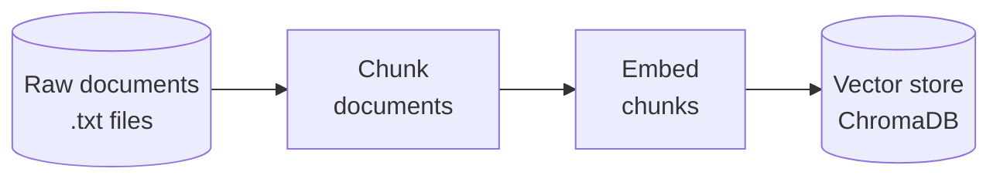
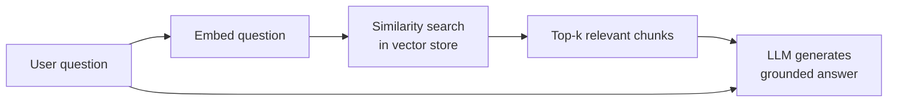
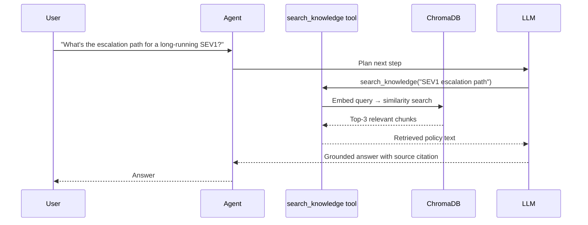
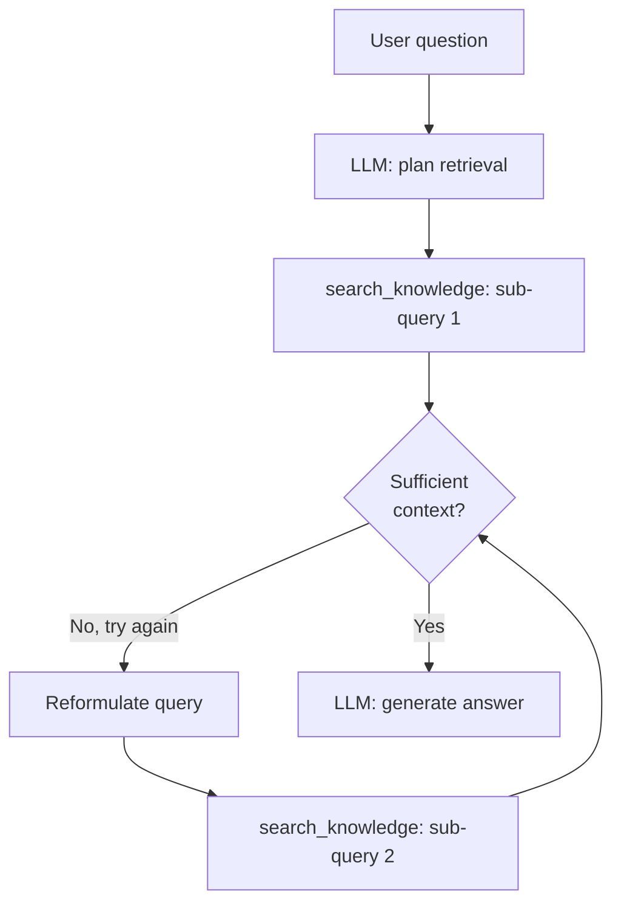
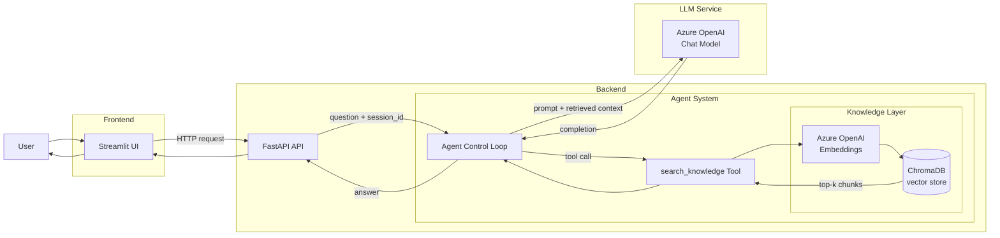

# Teaching the Agent to Use Knowledge — Local Knowledge and RAG

An LLM's training data has a cutoff date. It knows nothing about your organisation's internal knowledge: the policies your team operates under, the database schemas your services depend on, the API contracts between your systems, the architecture decision records that explain why things are built the way they are, the product documentation your support team references, or the runbooks your engineers follow during incidents. None of that exists in any public training corpus. For an agent to reason over it reliably, the knowledge must be made available at query time — not guessed from training data, and not pasted in manually on every call.

There are several established ways to give an agent access to local knowledge: injecting content directly into the system prompt, fine-tuning the model on your corpus, using a hardcoded lookup tool, or retrieving content dynamically at query time. Each approach has genuine strengths, specific valid use cases, and real limitations. The right choice depends on the size and stability of the knowledge base, how frequently it changes, and how varied the questions will be.

This post maps those approaches honestly — pros, valid use cases, and where each one breaks down — and then explains why **Retrieval-Augmented Generation (RAG)** is the right fit for the specific characteristics of the agent we are building. The implementation that follows replaces the key-based lookup tool from the previous posts with a semantic search tool backed by a vector store, expands the knowledge base to five documents, and keeps the same internal policy assistant running as the continuous example for the series.

---

## Ways to give an agent local knowledge

The field is moving quickly and new techniques continue to emerge — GraphRAG, agentic retrieval, memory-augmented architectures, and others are active areas of development. What follows covers the most established approaches in current production use. They are not mutually exclusive — many systems combine more than one — and each has a different cost profile, maintenance burden, and appropriate scope.

### 1. System prompt injection

The simplest approach: include the document text directly in the system prompt or in the first user message. The agent reads it on every call and answers from it.

**When it works:** Zero infrastructure, instant to implement, no latency overhead beyond the added tokens. The content is immediately available on every call without any retrieval step.

**Valid use cases:** A single reference document that is small, stable, and used on every call — for example, a short data dictionary, a fixed set of business rules, or a product description that the agent must always be aware of.

**Limitations:** The context window has a hard ceiling — once content exceeds a few pages, it either doesn't fit or dilutes the model's focus. Every token sent is a billed token on every call, so the cost scales directly with document size regardless of relevance. The content is exposed in every prompt, which increases the prompt injection attack surface for sensitive material. Any update requires redeploying the prompt.

### 2. Fine-tuning

Fine-tuning adapts a base model's weights by training it further on a curated dataset of domain content. The knowledge is baked into the model rather than injected at query time.

**When it works:** Can produce a model that consistently applies domain vocabulary, tone, and output structure without any retrieval infrastructure. No per-call context augmentation means slightly lower inference latency. Effective when you need the model to reliably follow a specific output format or schema.

**Valid use cases:** Teaching the model a domain-specific response style (legal, medical, financial); enforcing a consistent output structure (always emit JSON in a particular shape); adapting terminology for a specialist audience where generic phrasing is inadequate.

**Limitations:** Fine-tuning does not reliably encode factual knowledge — the model may produce plausible-sounding but incorrect answers when recalling specific rules under varied phrasing. Every update to the source content requires a full retraining run: curating the training dataset, running the training job (which requires GPU compute — typically hundreds to thousands of dollars depending on model size and dataset volume), evaluating the result, and redeploying the model. This requires ML engineering skills beyond typical application development and makes fine-tuning impractical for any knowledge that changes regularly. The knowledge is frozen at training time; there is no lightweight way to add a document.

> Fine-tuning is the right tool for teaching *how to respond*, not *what to know*. Use it alongside retrieval, not instead of it.

### 3. Hardcoded tool lookup

This is exactly what the previous two posts built: a `lookup_faq(key)` tool that maps predefined keys to document content. The agent calls the tool with a specific key, and the matching document is returned.

**When it works:** No external dependencies, deterministic, and easy to debug — you always know exactly which document was returned and why. Simple to implement and test.

**Valid use cases:** A small, enumerable set of documents (two to five) with stable, distinct names that map predictably to user intent — for example, a fixed set of configuration reference pages or a known list of product FAQs.

**Limitations:** The agent must be told all valid key names in the system prompt; as the knowledge base grows, this list either exceeds the prompt's useful length or becomes impossible to maintain. The agent will invent key names or silently fail when a question maps to a document not explicitly listed. Brittle to natural language variation — "what's the schema for the orders table?" may not reliably map to a key named `database-schema`. Adding any new document requires a prompt change and redeployment.

### 4. Retrieval-augmented generation (RAG)

RAG retrieves the most relevant content at query time by embedding the user's question and searching a vector store for semantically similar chunks. The agent never needs to know the document names in advance.

**When it works:** Scales to any corpus size without prompt changes. Retrieves by meaning, so users do not need to know or guess document names. The knowledge layer is decoupled from the agent code — adding a document means re-indexing a file, not redeploying the agent. Handles heterogeneous content through the same pipeline: policies, database schema documentation, API references, architecture decision records, and runbooks all index and retrieve the same way.

**Valid use cases:** Large or growing knowledge bases; content that changes frequently and independently of the agent; corpora queried in natural language with varied phrasing; multi-domain knowledge where document names are not known in advance.

**Limitations:** Retrieval quality depends on chunking strategy and embedding model choices — poor chunking produces chunks that are either too broad or lose context at their boundaries. Requires vector store infrastructure. Weak or ambiguous queries can surface loosely related chunks, which the LLM may use to confabulate an answer rather than report that nothing relevant was found. Pure dense retrieval can also miss exact-term matches (product codes, error identifiers) where sparse or hybrid retrieval would be more reliable.

### Comparison

| Method | Best for | Updates | Infrastructure | Limitations |
|---|---|---|---|---|
| System prompt injection | Single small document, used on every call | Prompt redeploy | None | Context window ceiling; per-call token cost; prompt injection risk |
| Fine-tuning | Domain vocabulary, tone, fixed output format | Full retraining run (expensive, slow) | Training pipeline + ML expertise | Does not reliably encode facts; knowledge frozen at training time |
| Hardcoded tool lookup | Small, enumerable, stable knowledge base | Prompt redeploy | None | Does not scale; agent must know all keys in advance |
| **RAG** | Large, growing, or heterogeneous knowledge | Re-index a file | Vector store + embeddings | Retrieval quality depends on chunking and embedding choices |

### Why RAG for this blog

The policy assistant in this series has four characteristics that make RAG the appropriate choice. The knowledge base is growing — five documents now, and a realistic engineering knowledge base would include dozens more. The documents change on their own schedule, independently of any code deployment. Engineers ask questions in natural language with no knowledge of or interest in document names or keys. And the content is heterogeneous: policies, runbooks, and operational procedures that share terminology but cover distinct topics.

System prompt injection would work for one or two documents but breaks on cost and window size as the corpus grows. Hardcoded lookup works for the two-document baseline in the previous posts, but requiring all key names to be enumerated is already showing its limits. Fine-tuning would require a training run every time a policy is updated — impractical for operational content that changes quarterly, and technically expensive for a team without a dedicated ML pipeline. RAG addresses all four characteristics directly: it indexes whatever documents exist, retrieves by meaning rather than key, updates by re-indexing a file rather than redeploying code, and the agent's tool description stays the same whether there are five documents or fifty.

---

## How RAG works

**[Retrieval-Augmented Generation](https://arxiv.org/abs/2005.11401)** (Lewis et al., 2020) is a pattern that augments an LLM's response with content retrieved from an external knowledge source at query time. It has two distinct phases: an **indexing phase** that runs once (or on document updates), and a **retrieval phase** that runs on every query.

### Indexing phase

Before the agent can retrieve anything, the documents need to be processed and stored in a form that supports similarity search.



**Chunking** splits each document into smaller pieces. A 1,000-word policy document might become six to ten chunks of 150–200 words each. The goal is that each chunk covers one coherent idea — a definition, a timeline, a set of rules — so that when a chunk is retrieved, it is self-contained and relevant. Chunks that are too large contain multiple ideas and dilute relevance. Chunks that are too small lose their surrounding context and become hard for the model to interpret.

**Embedding** converts each text chunk into a dense vector — a list of floating-point numbers that represents the chunk's meaning in high-dimensional space. Two chunks that are semantically similar (for example, "who can approve an exception?" and "exception approval process") will have vectors that are close together, regardless of the exact words used. This is what makes similarity search work: you are not matching keywords, you are matching meaning.

**Indexing** stores these vectors in a vector store alongside the original chunk text. The vector store's job is to answer the question "given this query vector, which stored vectors are closest?" efficiently.

### Retrieval phase

At query time, the user's question goes through the same embedding step and is compared against all stored vectors. The top-k most similar chunks are returned and injected into the LLM's prompt as context.



The LLM never sees the full document corpus. It sees only the question and the few chunks that are most relevant to it. This is why RAG produces grounded answers: the model is reasoning over retrieved facts, not relying on training data that may be stale or absent.

### How the agent uses retrieval

In the previous posts, the agent called `lookup_faq(key)` and the key had to match exactly. In this post, the agent calls `search_knowledge(query)` with a natural language description of what it needs. The retrieval layer handles the rest.



The agent's tool description no longer lists valid keys. It simply says: "Search the internal knowledge base for relevant policy content." That description works whether the knowledge base has two documents or two hundred.

---

## Chunking strategies

The most common question when implementing RAG is how to split documents. There is no universally correct answer, but there are practical trade-offs:

| Strategy | How it works | Works well when | Risk |
|---|---|---|---|
| **Fixed-size** | Split every N characters or tokens with optional overlap | Documents have uniform density, quick to implement | Cuts across sentence and paragraph boundaries |
| **Sentence-aware** | Split at sentence boundaries, group into fixed-token windows | Documents with clear sentence structure | Sentences within a group may cover unrelated ideas |
| **Paragraph / section** | Split at paragraph breaks or section headings | Well-structured documents (policies, runbooks) | Paragraph lengths vary widely; very long paragraphs become large chunks |
| **Semantic** | Use a model to identify topic shifts and split there | High-quality retrieval over diverse content | More complex, slower to index |

For structured policy documents — which is what this series uses — **paragraph-level splitting** is the right default. Each paragraph in a policy document covers a single rule, timeline, or role definition. Keeping paragraphs intact preserves that coherence. A fixed-size fallback handles any paragraph that is unusually long.

---

## Retrieval strategies

Chunking determines how the knowledge is stored. Retrieval determines how it is found. There are three strategies in practical use, and the choice between them depends on the type of queries your agent receives.

| Strategy | Mechanism | Best for | Limitation |
|---|---|---|---|
| **Dense (vector)** | Embed both the query and the stored chunks; rank by vector similarity | Semantic, paraphrase-tolerant queries ("what is allowed during a freeze?") | Can miss exact-match terms such as product codes, acronyms, or proper nouns |
| **Sparse (keyword / BM25)** | Score based on term frequency and inverse document frequency — how often a term appears in a chunk vs. across the corpus | Exact term matching, short lookup queries | Fails when the user paraphrases or uses synonyms the document does not contain |
| **Hybrid** | Combine dense and sparse scores — typically via weighted fusion or **[Reciprocal Rank Fusion (RRF)](https://learn.microsoft.com/azure/search/hybrid-search-ranking)** | Production corpora where queries mix conceptual questions and exact-term lookups | Requires more infrastructure and tuning of fusion weights |

**Dense retrieval** is the right default for policy documents. Engineers asking about escalation paths, approval workflows, or deployment rules are using natural language — not searching by exact policy identifiers. Dense retrieval handles paraphrasing naturally, because it operates on meaning rather than terms.

**When to add sparse retrieval:** when the corpus contains content where exact terms matter — ticket numbers, error codes, tool names, or any identifier that an embedding model may not distinguish reliably from similar-looking strings. The natural production path for hybrid retrieval in an Azure context is **[Azure AI Search](https://learn.microsoft.com/azure/search/search-what-is-azure-search)**, which supports both dense and sparse ranking natively with built-in RRF fusion.

**What this blog implements:** dense-only retrieval, using ChromaDB with cosine similarity. This is sufficient for the policy document corpus used here and keeps the implementation focused on the retrieval concept rather than search infrastructure.

---

## Semantic scoring

Choosing a retrieval strategy tells you *what to search*. Choosing a scoring method tells you *how to measure similarity* between the query vector and stored chunk vectors. The scoring method is set when you create the vector store collection — in this post, `{"hnsw:space": "cosine"}` in `build_index()`.

| Scoring method | What it measures | Range | Best for |
|---|---|---|---|
| **Cosine similarity** | The angle between two vectors — direction only, not magnitude | −1 to 1 (higher = more similar) | Text embeddings; insensitive to vector length, which varies with text length |
| **Dot product** | Magnitude × direction combined | Unbounded | Equivalent to cosine when embeddings are L2-normalised; marginally faster to compute |
| **Euclidean distance** | Absolute geometric distance between two vectors | 0 to ∞ (lower = more similar) | Image embeddings and dense retrieval tasks where magnitude carries meaning; less suited to text |

**Cosine similarity** is the standard choice for text embeddings. It measures whether two vectors point in the same direction in the embedding space — which corresponds to semantic similarity — regardless of how long the text was. A short FAQ answer and a full paragraph that cover the same topic will have a high cosine score even though their raw vectors have different magnitudes.

### Score thresholds

Cosine similarity returns a score for every chunk in the collection, including chunks that are barely related to the query. Without a threshold, the top-k results always include something — even if none of the chunks are genuinely relevant. That noise is then passed to the LLM, which may confabulate an answer from weakly related content rather than reporting that it found nothing useful.

A **score threshold** filters out chunks below a minimum similarity before passing results to the LLM. In ChromaDB, `query()` returns distances (lower = more similar for cosine space), so the threshold is applied as a maximum distance rather than a minimum score.

For short, structured policy documents, a distance threshold of `0.4` is a practical starting point: chunks with distance above this are weak matches that add noise rather than grounding. Adjust it by testing with questions that should and should not find relevant content, and inspecting which chunks the tool returns.

### Re-ranking

A threshold removes clearly irrelevant chunks. For larger corpora — hundreds of documents, long-tail query distributions — the initial dense retrieval set may still contain multiple plausible-looking but imprecise chunks. **Cross-encoder re-ranking** addresses this: after dense retrieval returns top-k candidates, a separate model scores each (query, chunk) pair jointly, producing a finer-grained relevance ranking. The re-ranked top results are passed to the LLM rather than the raw similarity-ordered set.

Re-ranking adds latency and a second model call on every query. It is not implemented in this blog — the policy corpus is small and well-separated enough that cosine similarity with a threshold produces clean results. It becomes relevant when the initial retrieval set consistently contains off-topic chunks that a threshold alone cannot remove.

---

## Agentic retrieval

Standard RAG follows a fixed pipeline: one query → one embedding → one vector search → top-k chunks → LLM response. The retrieval step is passive — it runs once and hands whatever it finds to the model. **Agentic retrieval** replaces that fixed pipeline with an agent-controlled loop: the LLM decides *how* to retrieve, *what* to retrieve next, and *when* enough has been retrieved to answer.

In practice, agentic retrieval means the agent can:

- **Decompose complex questions** into sub-queries and retrieve separately for each. A question like "What approval do I need to deploy during both a release freeze and an active SEV1?" is better answered by two targeted retrievals than by one broad query that may return irrelevant chunks.
- **Reformulate queries on low confidence.** If the first retrieval returns no results above the score threshold, the agent can paraphrase the query and try again before reporting that nothing was found.
- **Route across multiple knowledge sources.** Rather than querying a single vector store, the agent can decide whether a question is best answered from the policy corpus, a structured database, or a live API call — and compose the results.
- **Iterate until sufficient context is gathered.** For multi-step reasoning tasks, the agent retrieves, reads, and retrieves again as its understanding of the question evolves.

This pattern is sometimes called **retrieval as tool use**: the search tool is called multiple times within a single control loop iteration, with each call informed by what the previous one returned.



**What this blog implements:** single-pass retrieval — one `search_knowledge` call per user turn. This is the right starting point: it establishes the retrieval pattern clearly and is sufficient for direct policy questions where a single query reliably surfaces the relevant chunk. The agent's `tool_choice="auto"` setting already allows it to call `search_knowledge` more than once in a single turn if the LLM judges it necessary — agentic retrieval emerges naturally from that capability as question complexity grows.

---

## Embedding models

Before writing any code, you need to choose an embedding model. The choice affects retrieval quality, vector dimensionality, and cost on every indexing and query call.

Azure OpenAI offers three embedding model families. The right choice depends on where you are in the build cycle.

| Model | Dimensions | Context window | Best for | Relative cost |
|---|---|---|---|---|
| **`text-embedding-ada-002`** | 1,536 | 8,191 tokens | Legacy workloads, widest availability | Low |
| **`text-embedding-3-small`** | 512–1,536 (configurable) | 8,191 tokens | Prototyping, cost-sensitive workloads | Lower than ada-002 |
| **`text-embedding-3-large`** | 256–3,072 (configurable) | 8,191 tokens | Production, highest retrieval accuracy | Medium |

See the full comparison on the **[Azure OpenAI embeddings documentation](https://learn.microsoft.com/azure/ai-services/openai/concepts/understand-embeddings)** and the **[OpenAI embeddings guide](https://platform.openai.com/docs/guides/embeddings)**.

**`text-embedding-ada-002`** was the standard choice for several years and remains widely deployed. It produces 1,536-dimensional vectors and performs reliably on general-purpose retrieval tasks. Its main limitation is that the dimensionality is fixed and its accuracy on nuanced semantic matching lags behind the newer models.

**`text-embedding-3-small`** is the updated, lower-cost replacement for ada-002. It performs better on standard retrieval benchmarks at a lower price per token, and its dimensionality can be reduced (to 512, for example) to lower storage and search cost without a significant quality penalty.

**`text-embedding-3-large`** produces higher-quality embeddings, particularly for queries that require fine-grained semantic discrimination — distinguishing between closely related topics, or matching across languages. The quality improvement is measurable on complex corpora; on short, clearly structured policy documents, the improvement is marginal.

**For this blog:** `text-embedding-3-small` at default dimensionality (1,536) is sufficient. The policy documents are short and well-structured; the semantic differences between topics (SEV1, release freeze, on-call rotation) are large enough that a smaller model distinguishes them cleanly. The cost advantage over `text-embedding-3-large` is material when you are re-indexing frequently during development.

**When to move to `text-embedding-3-large`:** When the knowledge base contains documents with overlapping terminology, or when retrieval quality on nuanced queries is measurably insufficient. Swap the model in `AZURE_OPENAI_EMBEDDING_DEPLOYMENT` — no other code changes required.

> **No Azure subscription yet?** **[free-llm-api-resources](https://github.com/cheahjs/free-llm-api-resources)** tracks free tiers, trial credits, and open-access endpoints across providers, including embedding-capable services.

---

## Vector stores

The vector store is where embeddings live and where similarity search happens. For this post, we will use **[ChromaDB](https://docs.trychroma.com/)** — an open-source, in-process vector store that requires no separate infrastructure. It stores vectors and metadata locally, and its API maps directly to what the code needs: `add()` to index, `query()` to retrieve.

ChromaDB is the right choice for development and for agents that run on a single machine. When moving to production — distributed deployments, multi-tenant systems, or corpora that need to scale beyond a single server — replace it with a managed service. The two most relevant options in an Azure context are:

- **[Azure AI Search](https://learn.microsoft.com/azure/search/search-what-is-azure-search)** — a fully managed search service with native vector search, hybrid search (keyword + semantic), security integration, and built-in monitoring. The production default for Azure-deployed agents.
- **[pgvector](https://github.com/pgvector/pgvector)** — a PostgreSQL extension that adds vector similarity search to an existing Postgres database. Useful if your team already runs Postgres and wants to keep the stack simple.

**[Semantic Kernel's vector store connectors](https://learn.microsoft.com/semantic-kernel/concepts/vector-store-connectors/)** abstract over multiple backends using a common interface. Switching from ChromaDB to Azure AI Search in production is a configuration change, not a code rewrite.

---

## Building the agent

We have covered the problem (key-based lookup does not scale), the concept (embed → index → retrieve → augment), and chosen the components (ChromaDB + `text-embedding-3-small`). Now let's update the agent.

The architecture is the same three-tier system from the previous posts. What changes is the internals of the agent: the tool and the indexing step at startup.



Three changes from the previous post:

1. **Indexing at startup** — documents are chunked, embedded, and loaded into ChromaDB when the agent starts.
2. **`search_knowledge` replaces `lookup_faq`** — the tool takes a natural language query, not a key.
3. **System prompt updated** — the tool usage rules now describe retrieval behaviour, not key enumeration.

The API and UI layers carry forward from the previous post with minor additions.

We will implement the system in three files:

- **`agent.py`** — indexing, the search tool, agent assembly, and the stateful entry point
- **`api.py`** — thin HTTP wrapper, carries session management forward
- **`streamlit.py`** — chat UI with source attribution display

> **Prerequisites:**
> - Azure OpenAI resource with a deployed chat model (e.g., `gpt-4o-mini`) and a deployed embedding model (e.g., `text-embedding-3-small`)
> - Python 3.10+ with `semantic-kernel`, `chromadb`, and `openai` installed
> - A folder of `.txt` policy files (five are provided in `data/faq_docs/`)

### The agent code

Four patterns from the previous posts remain. This post adds two new ones:

1. **Model configuration** — same as before: chat model for reasoning.
2. **Embedding model configuration** — new: embedding model for indexing and query embedding.
3. **Indexing at startup** — new: chunk documents, embed each chunk, load into ChromaDB.
4. **Search tool** — replaces the key-based lookup tool with semantic similarity search.
5. **System prompt** — updated tool usage rules; persona, scope, format, and uncertainty sections are unchanged.
6. **Stateful execution** — carries forward from the previous post: `ChatHistory` per session.

**agent.py**

```python
import os
import asyncio
import uuid
from pathlib import Path

import chromadb
from openai import AzureOpenAI

from semantic_kernel.agents import ChatCompletionAgent
from semantic_kernel.connectors.ai.open_ai import AzureChatCompletion, OpenAIChatPromptExecutionSettings
from semantic_kernel.contents import ChatHistory
from semantic_kernel.functions import kernel_function, KernelArguments

from dotenv import load_dotenv
load_dotenv()

# --- Configuration ---
# Chat model: used by the agent's reasoning loop.
# Embedding model: used to convert text to vectors for indexing and retrieval.
AZURE_OPENAI_ENDPOINT       = os.environ["AZURE_OPENAI_ENDPOINT"]
AZURE_OPENAI_KEY            = os.environ["AZURE_OPENAI_API_KEY"]
AZURE_OPENAI_DEPLOYMENT     = os.environ["AZURE_OPENAI_DEPLOYMENT"]           # e.g. "gpt-4o-mini"
AZURE_OPENAI_EMBEDDING_DEPLOYMENT = os.environ["AZURE_OPENAI_EMBEDDING_DEPLOYMENT"]  # e.g. "text-embedding-3-small"

FAQ_DIR = Path("../data/faq_docs")
CHUNK_SIZE = 300          # Target characters per chunk; keeps each chunk focused on one idea
CHUNK_OVERLAP = 50        # Characters of overlap between adjacent chunks; preserves context at boundaries
TOP_K = 3                 # Number of chunks to retrieve per query; 3 gives enough context without noise
SCORE_THRESHOLD = 0.4     # Maximum cosine distance to accept; chunks above this are weak matches and filtered out

# --- Embedding client ---
# The AzureOpenAI client is used directly for embeddings.
# Semantic Kernel's ChatCompletionAgent handles the chat model separately.
_embed_client = AzureOpenAI(
    azure_endpoint=AZURE_OPENAI_ENDPOINT,
    api_key=AZURE_OPENAI_KEY,
    api_version="2024-02-01",
)

def embed(text: str) -> list[float]:
    """Convert a text string to an embedding vector using the configured Azure OpenAI model."""
    response = _embed_client.embeddings.create(
        input=text,
        model=AZURE_OPENAI_EMBEDDING_DEPLOYMENT,
    )
    return response.data[0].embedding

# --- Document chunking ---
# Split a document into overlapping character-level chunks.
# Overlap ensures that sentences crossing a chunk boundary are not lost.
def chunk_text(text: str, size: int = CHUNK_SIZE, overlap: int = CHUNK_OVERLAP) -> list[str]:
    chunks = []
    start = 0
    while start < len(text):
        end = min(start + size, len(text))
        chunks.append(text[start:end].strip())
        start += size - overlap
    return [c for c in chunks if c]  # Drop empty strings that can arise at the end

# --- Indexing ---
# Runs once at startup. Loads every .txt file, splits into chunks,
# embeds each chunk, and stores it in ChromaDB with source metadata.
def build_index() -> chromadb.Collection:
    """Load policy documents, chunk and embed them, and return a searchable ChromaDB collection."""
    client = chromadb.Client()
    collection = client.create_collection(
        name="policy-docs",
        metadata={"hnsw:space": "cosine"},  # Cosine similarity: standard for text embeddings
    )

    all_ids, all_embeddings, all_documents, all_metadatas = [], [], [], []

    for doc_path in FAQ_DIR.glob("*.txt"):
        text = doc_path.read_text(encoding="utf-8").strip()
        chunks = chunk_text(text)
        for i, chunk in enumerate(chunks):
            all_ids.append(f"{doc_path.stem}-chunk-{i}")       # Unique ID per chunk
            all_embeddings.append(embed(chunk))                  # Vector representation
            all_documents.append(chunk)                          # Original text (returned at query time)
            all_metadatas.append({"source": doc_path.stem})     # Source filename for citation

    collection.add(
        ids=all_ids,
        embeddings=all_embeddings,
        documents=all_documents,
        metadatas=all_metadatas,
    )
    print(f"Indexed {len(all_ids)} chunks from {len(list(FAQ_DIR.glob('*.txt')))} documents.")
    return collection

# Build the index once at module load time.
# In production, you would persist the ChromaDB collection to disk and only rebuild on document changes.
_collection = build_index()

# --- Search tool ---
# The agent calls this instead of lookup_faq.
# It takes a natural language query, embeds it, and returns the most relevant chunks.
class KnowledgeSearchTool:
    @kernel_function(
        name="search_knowledge",
        description=(
            "Search the internal knowledge base for relevant policy content. "
            "Pass the user's question or a rephrased version of it as the query. "
            "Returns the most relevant policy excerpts with their source document names."
        ),
    )
    def search_knowledge(self, query: str) -> str:
        query_vector = embed(query)
        results = _collection.query(
            query_embeddings=[query_vector],
            n_results=TOP_K,
            include=["documents", "metadatas", "distances"],  # distances needed for threshold filtering
        )
        # Apply score threshold: ChromaDB returns cosine distances (lower = more similar).
        # Chunks with distance above SCORE_THRESHOLD are weak matches; drop them before
        # passing anything to the LLM to avoid confabulation from low-confidence context.
        output_parts = []
        for doc, meta, distance in zip(
            results["documents"][0],
            results["metadatas"][0],
            results["distances"][0],
        ):
            if distance > SCORE_THRESHOLD:
                continue  # Skip chunks that are not sufficiently similar to the query
            source = meta.get("source", "unknown")
            output_parts.append(f"[Source: {source}]\n{doc}")

        if not output_parts:
            return "No relevant policy content found for this query."

        return "\n\n---\n\n".join(output_parts)

# --- Structured system prompt ---
# The TOOL USAGE RULES section no longer lists valid keys.
# The agent is told to search for what it needs; the retrieval layer handles selection.
INSTRUCTIONS = """
## PERSONA
You are the internal policy assistant for an engineering team.
You are precise, concise, and cite the specific policy that informs your answer.
You do not use filler phrases like "Great question!" or "Certainly!".

## SCOPE
You answer questions on engineering policies and operational procedures only:
- Release freezes, change management, and deployment procedures.
- SEV1 and SEV2 incident response, roles, and escalation.
- On-call rotation, handoffs, and escalation paths.

If a question is outside this scope, respond exactly:
  "I can only answer questions about engineering policies and operational procedures."

## TOOL USAGE RULES
- Always call search_knowledge before answering a policy question.
- Pass the user's question or a descriptive rephrasing of it as the query.
- Do not answer from memory; use only what the tool returns.
- If the tool returns no relevant content, say so and direct the user to the Release Manager or IC.

## RESPONSE FORMAT
- Answer in plain prose, 3–5 sentences maximum.
- If the answer involves a list of steps or roles, use a numbered or bulleted list.
- End every answer with: "Source: <document name from the retrieved content>"

## BEHAVIOUR UNDER UNCERTAINTY
- If the retrieved content does not answer the question, respond:
  "I could not find a policy that covers this. Please check with your Release Manager or Incident Commander."
- If the user's question is ambiguous, ask one clarifying question before calling the tool.
"""

# --- LLM parameters ---
SETTINGS = OpenAIChatPromptExecutionSettings(
    temperature=0.1,  # Low temperature: maximise consistency for factual policy answers
    max_tokens=600,
    tool_choice="auto",
)

# --- Agent assembly ---
_agent = ChatCompletionAgent(
    service=AzureChatCompletion(
        deployment_name=AZURE_OPENAI_DEPLOYMENT,
        endpoint=AZURE_OPENAI_ENDPOINT,
        api_key=AZURE_OPENAI_KEY,
    ),
    name="Policy-Assistant",
    instructions=INSTRUCTIONS,
    plugins=[KnowledgeSearchTool()],   # Semantic retrieval tool replaces key-based lookup
    arguments=KernelArguments(SETTINGS),
)

# --- In-process session store ---
# Same pattern as the previous post: one ChatHistory per session_id.
_sessions: dict[str, ChatHistory] = {}

def get_or_create_history(session_id: str) -> ChatHistory:
    if session_id not in _sessions:
        _sessions[session_id] = ChatHistory()
    return _sessions[session_id]

# --- Stateful agent entry point ---
async def ask_agent(question: str, session_id: str = "default") -> str:
    history = get_or_create_history(session_id)
    history.add_user_message(question)

    response_text = ""
    async for chunk in _agent.invoke(history):
        response_text += str(chunk.content)

    history.add_assistant_message(response_text)
    return response_text

def reset_session(session_id: str = "default") -> None:
    _sessions.pop(session_id, None)

async def main() -> None:
    """Interactive CLI loop. Type 'reset' to clear history, 'quit' to exit."""
    session_id = "cli-session"
    print("Policy Assistant (type 'reset' to clear history, 'quit' to exit)\n")
    while True:
        user_input = input("You: ").strip()
        if not user_input:
            continue
        if user_input.lower() == "quit":
            break
        if user_input.lower() == "reset":
            reset_session(session_id)
            print("[Session history cleared]\n")
            continue
        answer = await ask_agent(user_input, session_id=session_id)
        print(f"Agent: {answer}\n")

if __name__ == "__main__":
    asyncio.run(main())
```

The `build_index()` function runs once when the module loads. In production, you would persist the ChromaDB collection to disk (or use a managed service) so re-indexing only happens when documents change, not on every server start.

The API layer is unchanged in structure — it carries the session management introduced in the previous post.

**api.py**

```python
from fastapi import FastAPI
from pydantic import BaseModel

from agent import ask_agent, reset_session

app = FastAPI()

class Query(BaseModel):
    question: str
    session_id: str = "default"

class ResetRequest(BaseModel):
    session_id: str = "default"

# POST /ask — same interface as the previous post.
# The change is inside ask_agent: retrieval now happens via ChromaDB rather than a dict lookup.
# Keeping this layer thin means the same agent can be reused by any client
# (CLI, Streamlit, Slack bot, etc.) without changing agent.py.
@app.post("/ask")
async def ask(query: Query):
    answer = await ask_agent(query.question, session_id=query.session_id)
    return {"answer": answer, "session_id": query.session_id}

# POST /reset — clears the ChatHistory for a session.
@app.post("/reset")
async def reset(req: ResetRequest):
    reset_session(req.session_id)
    return {"status": "reset", "session_id": req.session_id}
```

The Streamlit UI adds one visible change: the answer may now cite source document names (because the system prompt instructs the agent to include them). No additional UI code is needed to display citations — they appear inline in the agent's response text.

**streamlit.py**

```python
import uuid
import requests
import streamlit as st

API_URL = "http://127.0.0.1:8000"

st.title("Policy Assistant")
st.caption("Retrieval-augmented — answers are grounded in indexed policy documents.")

# One session ID per browser tab, stored across re-runs.
if "session_id" not in st.session_state:
    st.session_state.session_id = str(uuid.uuid4())

if "messages" not in st.session_state:
    st.session_state.messages = []

# Render existing conversation
for msg in st.session_state.messages:
    with st.chat_message(msg["role"]):
        st.write(msg["content"])

question = st.chat_input("Ask a policy question...")

if question:
    st.session_state.messages.append({"role": "user", "content": question})
    with st.chat_message("user"):
        st.write(question)

    # The agent calls search_knowledge on the backend, retrieves relevant chunks,
    # and returns a grounded answer. The UI displays whatever the agent returns,
    # including any source citation appended by the structured system prompt.
    response = requests.post(
        f"{API_URL}/ask",
        json={"question": question, "session_id": st.session_state.session_id},
    )
    if response.ok:
        answer = response.json()["answer"]
    else:
        answer = "Request failed. Is the API server running?"

    st.session_state.messages.append({"role": "assistant", "content": answer})
    with st.chat_message("assistant"):
        st.write(answer)

with st.sidebar:
    st.header("Session")
    st.write(f"Session ID: `{st.session_state.session_id[:8]}...`")
    if st.button("Reset conversation"):
        requests.post(
            f"{API_URL}/reset",
            json={"session_id": st.session_state.session_id},
        )
        st.session_state.messages = []
        st.rerun()
```

---

## Example run

```bash
# 1) Set up the virtual environment (skip if carried over from a previous post)
python -m venv .venv
.venv\Scripts\activate          # Windows
# source .venv/bin/activate     # macOS / Linux

# 2) Install dependencies
pip install -r requirements.txt

# 3) Set up credentials
cp .env.template .env
# Fill in AZURE_OPENAI_ENDPOINT, AZURE_OPENAI_API_KEY,
# AZURE_OPENAI_DEPLOYMENT, and AZURE_OPENAI_EMBEDDING_DEPLOYMENT

# 4) Run the agent from the CLI — try questions across different policy documents
python agent.py
# Try: "What is the escalation path if a SEV1 runs longer than 45 minutes?"
# Try: "Who chairs the change advisory board?"
# Try: "What checks are required after a production deployment?"
# Try: "How do I swap an on-call shift?"
# Notice: the agent retrieves relevant content regardless of document name

# 5) Start the API server
uvicorn api:app --reload

# 6) Test retrieval across documents via the API
curl -X POST http://127.0.0.1:8000/ask \
  -H "Content-Type: application/json" \
  -d "{\"question\": \"Can I deploy during a release freeze if there is an active SEV1?\", \"session_id\": \"test\"}"

curl -X POST http://127.0.0.1:8000/ask \
  -H "Content-Type: application/json" \
  -d "{\"question\": \"What comes next in that process?\", \"session_id\": \"test\"}"

# 7) Run the Streamlit UI
streamlit run streamlit.py
```

The second `curl` call demonstrates that retrieval and conversation state work together: the agent uses the `ChatHistory` from the previous turn to understand "that process" and retrieves the right follow-up content.

---

## Closing note

Try adding a sixth policy document — paste in any internal wiki page as a `.txt` file and restart the agent. The agent will answer questions about it immediately with no prompt changes. That is the practical payoff of retrieval: the knowledge boundary is determined by the document corpus, not by the system prompt.

You can also experiment with `CHUNK_SIZE` and `TOP_K` to see how retrieval quality shifts: smaller chunks improve precision but may lose context; larger `TOP_K` gives the model more material to work with but increases token usage and can introduce noise. Keeping changes small and testing with specific questions is the fastest way to find the right balance for your documents.

**What's next:** in the next post we will extend the agent with tools that take actions — querying a database, calling an API, drafting a structured output — rather than only retrieving and responding in text. That is also where the full multi-query, multi-source agentic retrieval pattern becomes relevant: the retrieval architecture built here is the foundation it extends.
