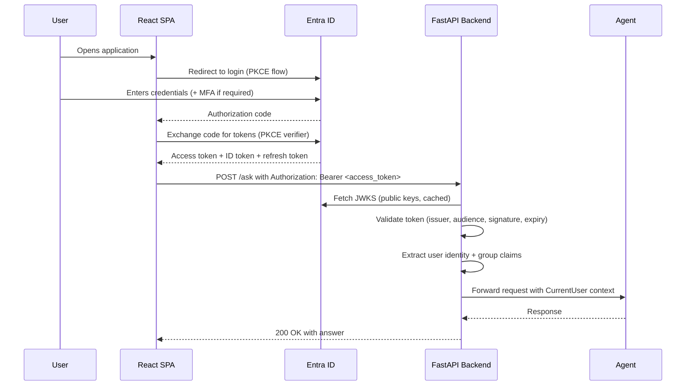

# SSO Authentication for AI Agents — Azure AD / Microsoft Entra ID

> **Pillar 2 — Security and Identity** | Part of the [Production Deep Dives](../blog.md) series
>
> This is the step-by-step implementation guide for SSO authentication. It covers everything from app registration to JWT validation in FastAPI, including group-based access control and the frontend MSAL integration. The architecture used throughout is the FastAPI backend + React frontend established in earlier series blogs.

---

## Executive Summary

- Authentication is the prerequisite for every other production security control. Until you know who is making a request, RBAC, audit logging, row-level security, and per-user cost attribution are all impossible to implement correctly.
- Azure AD (Microsoft Entra ID) SSO ties the agent into the organisation's existing identity infrastructure — the same identity provider that governs email, SharePoint, and every other enterprise system. Users authenticate once and carry that identity into the agent.
- Two app registrations are required: one that exposes the backend API as a protected resource with named scopes, and one that represents the frontend SPA requesting access on behalf of the user.
- JWT validation in the FastAPI backend must verify the token's issuer, audience, signature, and expiry on every request — not just on login. A valid token from five minutes ago is not sufficient evidence of the user's current authorisation state.
- Group membership claims extracted from the validated token are the mechanism for role-based access control — determining which tools the user can call, which documents they can retrieve, and which agent capabilities are available to them.
- This guide implements **Level 5 — Production-governed AI systems**: identity-aware, auditable, and aligned to the enterprise's existing access control model.

---

## Strategic Context

An AI agent without authentication is not a tool — it is an open endpoint. Any caller with network access can invoke it, consume quota, retrieve internal documents, and trigger tool actions, all without leaving a trace of who did it or why.

The failure mode is predictable: the agent is deployed, a URL is shared internally, and within days it is being called by automated scripts, load tests, and curious engineers exploring the API — none of whom were the intended users, and none of whose activity is attributable to a human identity. When an unexpected LLM response appears or a document is retrieved that should not have been, there is no audit trail to reconstruct what happened.

API keys are not a solution to this problem. An API key answers "is this a known caller?" — it does not answer "who is this person?", "what are they authorised to do?", or "should this specific request be allowed?". API keys are static, shared, and not tied to the organisation's identity lifecycle — when an employee leaves, their API key does not expire with their Entra ID account.

SSO authentication with Azure AD solves the identity problem structurally: every request carries a short-lived, cryptographically signed token that identifies the user, their group memberships, and their organisational context. The token is issued by the organisation's identity provider and expires automatically. Revocation is instant — disable the account in Entra ID and all tokens issued to that account are immediately invalid.

---

## Conceptual Model

### The Two-App-Registration Pattern

A common mistake is registering a single application for both the frontend and backend. This conflates two distinct concerns: the frontend SPA *requests access* on behalf of the user; the backend API *enforces access* by validating the token it receives. They require separate registrations.

```
┌─────────────────────────────────────────────────────────────────┐
│  Azure AD / Microsoft Entra ID                                  │
│                                                                 │
│  App Registration 1: agent-api                                  │
│  - Exposes API scopes: agent.query, agent.admin                 │
│  - Application ID URI: api://<client-id>                        │
│                                                                 │
│  App Registration 2: agent-spa                                  │
│  - Platform: Single-page application                            │
│  - Redirect URIs: https://your-app.azurecontainerapps.io        │
│  - Delegated permissions: User.Read, GroupMember.Read.All       │
│  - Exposes NO scopes (requests them from agent-api)             │
└─────────────────────────────────────────────────────────────────┘
```

### The Authentication Flow at Runtime



### Token Contents (What the Backend Receives)

The access token is a JWT. After validation, the backend can read:

```json
{
  "oid": "user-object-id",
  "upn": "user@organisation.com",
  "name": "User Display Name",
  "groups": ["group-id-1", "group-id-2"],
  "scp": "agent.query",
  "aud": "api://<backend-client-id>",
  "iss": "https://sts.windows.net/<tenant-id>/",
  "exp": 1710000000
}
```

The `groups` claim contains the Entra ID object IDs of the security groups the user belongs to. This is the basis for access control decisions downstream.

---

## When This Is Not Needed

- **Local development** — use a hardcoded test identity or disable auth entirely for local runs; do not attempt to replicate SSO in a local environment
- **Single-user internal scripts** — a Python script that one person runs from their machine has no need for SSO; a service account with a managed identity is more appropriate
- **Behind-VPN internal tools with no multi-user access control** — if the tool serves a single team with identical permissions and is not accessible from outside a trusted network, SSO adds overhead without benefit

Apply SSO when: the agent is accessible by more than one person, when different users should have different permissions, or when you need an audit trail of who did what.

---

## Other Identity Providers

This guide implements SSO using **Azure AD / Microsoft Entra ID** — the natural choice for organisations already on Microsoft 365. The OAuth 2.0 / OIDC protocol and the FastAPI JWT validation pattern are identity-provider-agnostic; only the configuration values (issuer URL, JWKS endpoint, token claims) differ between providers.

If your organisation uses a different identity provider, the same architectural pattern applies. Official documentation for the most common alternatives:

| Provider | Use Case | Official Documentation |
|---|---|---|
| **Google Identity** | Google Workspace organisations; consumer-facing applications | [Google Identity — OAuth 2.0 for Web Server Apps](https://developers.google.com/identity/protocols/oauth2/web-server) · [Google Sign-In for Web](https://developers.google.com/identity/sign-in/web/sign-in) |
| **Okta** | Enterprises with Okta as the corporate IdP; multi-tenant SaaS | [Okta Developer Docs — Add Authentication to Your App](https://developer.okta.com/docs/guides/sign-into-spa-redirect/) · [Okta OIDC Reference](https://developer.okta.com/docs/reference/api/oidc/) |
| **Auth0 (by Okta)** | Flexible multi-provider auth; B2C with social login | [Auth0 — Single-Page App Quickstart (React)](https://auth0.com/docs/quickstart/spa/react) · [Auth0 — Protect your API](https://auth0.com/docs/quickstart/backend/python) |
| **AWS Cognito** | AWS-native deployments; user pools with RBAC | [Amazon Cognito — User Pool Auth Flow](https://docs.aws.amazon.com/cognito/latest/developerguide/amazon-cognito-user-pools-authentication-flow.html) · [Cognito — JWT Token Validation](https://docs.aws.amazon.com/cognito/latest/developerguide/amazon-cognito-user-pools-using-tokens-verifying-a-jwt.html) |
| **Keycloak** | Self-hosted / on-premise; full control over identity infrastructure | [Keycloak — Securing Applications](https://www.keycloak.org/docs/latest/securing_apps/) · [Keycloak — OIDC Protocol](https://www.keycloak.org/docs/latest/server_admin/#_oidc) |
| **GitHub OAuth** | Developer tools; internal tooling for engineering teams | [GitHub — OAuth Apps](https://docs.github.com/en/apps/oauth-apps/building-oauth-apps/authorizing-oauth-apps) · [GitHub — OIDC](https://docs.github.com/en/actions/security-for-github-actions/security-hardening-your-deployments/about-security-hardening-with-openid-connect) |

> **Provider selection guidance:**
> - **Microsoft 365 organisation** → Azure AD / Entra ID (this guide)
> - **Google Workspace organisation** → Google Identity
> - **Enterprise with existing Okta deployment** → Okta or Auth0
> - **AWS-native deployment** → AWS Cognito
> - **Air-gapped or on-premise requirement** → Keycloak
> - **Internal developer tool** → GitHub OAuth (simpler setup, weaker RBAC than enterprise IdPs)

The JWT validation code in Step 5 of this guide requires three provider-specific values regardless of which provider you use: the **JWKS endpoint URL**, the **issuer string**, and the **audience claim**. Every provider above publishes these in their OIDC discovery document at `<issuer>/.well-known/openid-configuration`.

---

## Step-by-Step Implementation

### Prerequisites

- Azure subscription with permission to create App Registrations in Entra ID
- Azure CLI installed and authenticated (`az login`)
- The FastAPI backend and React frontend from the series (or equivalent)
- `python-jose[cryptography]` and `httpx` installed in the backend
- `@azure/msal-react` and `@azure/msal-browser` v3+ installed in the frontend — v3 requires explicit instance initialization before the instance is passed to `MsalProvider` (see Step 4)

---

### Step 1 — Register the Backend API Application

This registration defines the protected resource. The frontend will request tokens scoped to this application.

#### Via Azure CLI

```bash
# Create the backend API app registration
az ad app create \
  --display-name "agent-api" \
  --sign-in-audience AzureADMyOrg

# Note the appId from the output — this is your BACKEND_CLIENT_ID
# Example output: { "appId": "xxxxxxxx-xxxx-xxxx-xxxx-xxxxxxxxxxxx", ... }
```

#### Expose API Scopes

```bash
# Set the Application ID URI (required before adding scopes)
BACKEND_CLIENT_ID="<appId-from-above>"

az ad app update \
  --id $BACKEND_CLIENT_ID \
  --identifier-uris "api://$BACKEND_CLIENT_ID"

# Add the agent.query scope
# This must be done via the portal (API permissions → Expose an API)
# or via Microsoft Graph API — the az CLI does not support scope creation directly
```

#### Via Azure Portal (to add scopes)

1. Navigate to: **Azure Portal** → **Microsoft Entra ID** → **App registrations**
2. Select `agent-api`
3. Click **Expose an API** → **Add a scope**
4. Set **Scope name:** `agent.query`
5. Set **Who can consent:** `Admins and users`
6. Set **Admin consent display name:** `Query the AI agent`
7. Set **Admin consent description:** `Allows the application to send queries to the AI agent on behalf of the signed-in user`
8. Set **State:** `Enabled`
9. Click **Add scope**
10. Repeat for `agent.admin` (for administrative operations)

Your Application ID URI is now `api://<BACKEND_CLIENT_ID>` and the full scope identifiers are:
- `api://<BACKEND_CLIENT_ID>/agent.query`
- `api://<BACKEND_CLIENT_ID>/agent.admin`

---

### Step 2 — Register the Frontend SPA Application

This registration represents the React frontend. It uses the OAuth 2.0 Authorization Code Flow with PKCE — the correct flow for browser-based applications.

#### Via Azure CLI

```bash
# Create the SPA app registration
az ad app create \
  --display-name "agent-spa" \
  --sign-in-audience AzureADMyOrg

# Note the appId — this is your FRONTEND_CLIENT_ID (used in React config)
```

#### Configure the SPA Platform

This step must be done in the portal — the Azure CLI does not support SPA platform configuration directly.

1. Navigate to: **Azure Portal** → **Microsoft Entra ID** → **App registrations**
2. Select `agent-spa`
3. Click **Authentication** → **Add a platform** → **Single-page application**
4. Add redirect URI: `https://<your-container-app-url>`
   - Also add `http://localhost:3000` for local development
5. Under **Implicit grant and hybrid flows**, enable:
   - ✅ **Access tokens**
   - ✅ **ID tokens**
6. Click **Configure**

> **Why Single-page application, not Web?**
> The "Web" platform uses the Authorization Code Flow with a client secret — appropriate for server-side applications that can keep a secret. An SPA runs in the browser and cannot keep a secret. The SPA platform uses PKCE instead, which provides equivalent security without requiring a secret in client-side code.

#### Configure API Permissions

1. Click **API permissions** → **Add a permission**
2. Select **Microsoft Graph** → **Delegated permissions**
3. Add the following permissions:
   - `User.Read` — read the signed-in user's profile (no admin consent required)
   - `Directory.Read.All` — read directory data (requires admin consent)
   - `GroupMember.Read.All` — read group memberships (requires admin consent)
4. Click **Add permissions**
5. Click **Add a permission** again → **My APIs** → Select `agent-api`
6. Add `agent.query` (and `agent.admin` if needed)
7. Click **Add permissions**

#### Grant Admin Consent

The `Directory.Read.All` and `GroupMember.Read.All` permissions require an administrator to grant consent on behalf of the organisation. Without this, every user sees a consent screen on first login.

```bash
# Grant admin consent via URL (open in browser, signed in as admin)
# Replace <tenant-id> and <frontend-client-id>
https://login.microsoftonline.com/<tenant-id>/adminconsent?client_id=<frontend-client-id>
```

Or via the portal:
1. **API permissions** → **Grant admin consent for \<organisation\>**
2. Confirm by clicking **Yes**

> **Important:** The login request in the SPA should only include Microsoft Graph permissions and the backend API scope. Do not add backend scopes to the Graph permission request — keep them separate. The SPA requests Graph permissions at login and the backend API scope when acquiring a token for API calls.

---

### Step 3 — Retrieve Your Configuration Values

```bash
# Get your tenant ID
az account show --query tenantId -o tsv

# Get backend client ID
az ad app list --display-name "agent-api" --query "[0].appId" -o tsv

# Get frontend client ID
az ad app list --display-name "agent-spa" --query "[0].appId" -o tsv
```

You now have three values needed for configuration:
- `TENANT_ID`
- `BACKEND_CLIENT_ID` (used in backend JWT validation)
- `FRONTEND_CLIENT_ID` (used in React MSAL config)

---

### Step 4 — Frontend: MSAL Integration (React)

Install the MSAL libraries:

```bash
npm install @azure/msal-react @azure/msal-browser
```

**`src/authConfig.ts`**

```typescript
import { Configuration, PopupRequest } from "@azure/msal-browser";

// MSAL configuration — loaded from environment variables at runtime
// Never hardcode client IDs or tenant IDs in source code
export const msalConfig: Configuration = {
  auth: {
    clientId: process.env.REACT_APP_AZURE_CLIENT_ID!,
    authority: `https://login.microsoftonline.com/${process.env.REACT_APP_AZURE_TENANT_ID}`,
    redirectUri: window.location.origin,  // Matches the redirect URI in app registration
  },
  cache: {
    cacheLocation: "sessionStorage",      // sessionStorage: cleared on tab close (more secure)
    storeAuthStateInCookie: false,        // Set true only if IE11 support is required
  },
};

// Scopes for the login request — Microsoft Graph only
// Do NOT include backend API scopes here
export const loginRequest: PopupRequest = {
  scopes: [
    "User.Read",
    "GroupMember.Read.All",
  ],
};

// Scopes for acquiring a token to call the backend API
// Requested separately via acquireTokenSilent, not at login
export const apiRequest: PopupRequest = {
  scopes: [
    `api://${process.env.REACT_APP_AZURE_BACKEND_CLIENT_ID}/agent.query`,
  ],
};
```

**`src/index.tsx`** — wrap the app with `MsalProvider`

```typescript
import React from "react";
import ReactDOM from "react-dom/client";
import { PublicClientApplication } from "@azure/msal-browser";
import { MsalProvider } from "@azure/msal-react";
import { msalConfig } from "./authConfig";
import App from "./App";

// Create the MSAL instance once at app startup.
// This instance manages token acquisition and caching for the entire app.
const msalInstance = new PublicClientApplication(msalConfig);

// initialize() must be awaited before rendering. It is an async operation that:
//   1. Restores any cached account state from sessionStorage.
//   2. Processes the redirect response in the URL (the ?code=... returned by
//      Azure AD after the user authenticates).
//   3. Exchanges the authorisation code for tokens and writes them to the cache.
//
// Only once initialize() resolves is authentication state reliable for any
// component in the tree. Passing the instance to MsalProvider before this
// completes means useIsAuthenticated() has no stable state to read from.
msalInstance.initialize().then(() => {
  const root = ReactDOM.createRoot(document.getElementById("root") as HTMLElement);
  root.render(
    <React.StrictMode>
      <MsalProvider instance={msalInstance}>
        <App />
      </MsalProvider>
    </React.StrictMode>
  );
});
```

**`src/hooks/useApiToken.ts`** — acquire a token for backend API calls

```typescript
import { useMsal } from "@azure/msal-react";
import { apiRequest } from "../authConfig";

// Custom hook that acquires a backend API token silently (from cache or via refresh token)
// Falls back to interactive popup if silent acquisition fails (e.g., token expired, consent needed)
export function useApiToken() {
  const { instance, accounts } = useMsal();

  const getToken = async (): Promise<string> => {
    if (accounts.length === 0) throw new Error("No authenticated account");

    try {
      // Try silent acquisition first — uses cached token or refresh token
      const result = await instance.acquireTokenSilent({
        ...apiRequest,
        account: accounts[0],
      });
      return result.accessToken;
    } catch {
      // Silent acquisition failed (interaction required) — show popup
      const result = await instance.acquireTokenPopup(apiRequest);
      return result.accessToken;
    }
  };

  return { getToken };
}
```

**`src/api/agentApi.ts`** — send authenticated requests to the backend

```typescript
import { useApiToken } from "../hooks/useApiToken";

const API_BASE_URL = process.env.REACT_APP_API_URL || "http://localhost:8000";

export function useAgentApi() {
  const { getToken } = useApiToken();

  const askQuestion = async (question: string, sessionId: string): Promise<string> => {
    // Acquire a fresh backend API token before each request
    // MSAL handles caching — this call is cheap when the token is still valid
    const token = await getToken();

    const response = await fetch(`${API_BASE_URL}/ask`, {
      method: "POST",
      headers: {
        "Content-Type": "application/json",
        "Authorization": `Bearer ${token}`,  // JWT token validated by FastAPI
      },
      body: JSON.stringify({ question, session_id: sessionId }),
    });

    if (!response.ok) {
      const error = await response.json();
      throw new Error(error.detail || "Request failed");
    }

    return (await response.json()).answer;
  };

  return { askQuestion };
}
```

**`src/components/AuthGuard.tsx`** — protect routes that require authentication

```typescript
import { useIsAuthenticated, useMsal } from "@azure/msal-react";
import { InteractionStatus } from "@azure/msal-browser";
import { loginRequest } from "../authConfig";

interface AuthGuardProps {
  children: React.ReactNode;
}

// Wraps any component that requires authentication.
// Redirects unauthenticated users to the Microsoft login page.
//
// loginRedirect is only called when inProgress === InteractionStatus.None.
// This guards against state changes during active MSAL interactions — for example,
// when acquireTokenSilent falls back to a redirect, or during logoutRedirect.
// In those cases, useIsAuthenticated() may not yet reflect the final state.
// Waiting for InteractionStatus.None ensures the guard only evaluates
// stable, settled authentication state.
export function AuthGuard({ children }: AuthGuardProps) {
  const isAuthenticated = useIsAuthenticated();
  const { instance, inProgress } = useMsal();

  // An MSAL interaction is in progress — authentication state is not yet settled.
  // Wait for it to complete before evaluating or triggering any redirect.
  if (inProgress !== InteractionStatus.None) {
    return <div>Loading...</div>;
  }

  // MSAL is idle and user is not authenticated — safe to initiate login redirect.
  if (!isAuthenticated) {
    instance.loginRedirect(loginRequest);
    return <div>Redirecting to sign-in...</div>;
  }

  return <>{children}</>;
}
```

---

### Step 5 — Backend: JWT Validation (FastAPI)

Install dependencies:

```bash
pip install python-jose[cryptography] httpx
```

**`api/auth.py`**

```python
import os
import httpx
from functools import lru_cache
from typing import Optional

from fastapi import Depends, HTTPException, status
from fastapi.security import HTTPAuthorizationCredentials, HTTPBearer
from jose import JWTError, jwt
from pydantic import BaseModel

TENANT_ID = os.environ["AZURE_AD_TENANT_ID"]
BACKEND_CLIENT_ID = os.environ["AZURE_AD_CLIENT_ID"]  # Backend API client ID

# Token issuer — must match exactly what Entra ID puts in the 'iss' claim
ISSUER = f"https://sts.windows.net/{TENANT_ID}/"

# JWKS endpoint — Entra ID's public keys for token signature verification
JWKS_URL = f"https://login.microsoftonline.com/{TENANT_ID}/discovery/v2.0/keys"

# HTTPBearer extracts the token from the Authorization: Bearer <token> header
bearer_scheme = HTTPBearer()


class CurrentUser(BaseModel):
    """Typed representation of the authenticated user, extracted from the JWT."""
    object_id: str           # Entra ID user object ID (stable unique identifier)
    upn: str                 # User principal name (email address)
    display_name: str        # Display name
    groups: list[str]        # List of group object IDs the user belongs to
    scopes: list[str]        # API scopes granted in this token (e.g. ["agent.query"])


@lru_cache(maxsize=1)
def _get_jwks() -> dict:
    """Fetch and cache JWKS (public keys) from Entra ID.

    Cached to avoid fetching keys on every request.
    In production, implement cache invalidation with a TTL.
    Keys change infrequently but the cache should be refreshable.
    """
    response = httpx.get(JWKS_URL, timeout=10)
    response.raise_for_status()
    return response.json()


def _validate_token(token: str) -> dict:
    """Validate a JWT access token issued by Entra ID.

    Performs full validation:
    - Signature verification using Entra ID public keys
    - Issuer check: must be this tenant's STS
    - Audience check: must be this backend API's client ID
    - Expiry check: token must not be expired

    Returns the decoded token claims on success.
    Raises HTTPException 401 on any validation failure.
    """
    try:
        jwks = _get_jwks()

        # Decode and validate the token
        # python-jose verifies signature, issuer, audience, and expiry automatically
        claims = jwt.decode(
            token,
            jwks,
            algorithms=["RS256"],
            audience=BACKEND_CLIENT_ID,
            issuer=ISSUER,
            options={"verify_at_hash": False},  # Not required for access tokens
        )
        return claims

    except JWTError as e:
        raise HTTPException(
            status_code=status.HTTP_401_UNAUTHORIZED,
            detail=f"Token validation failed: {str(e)}",
            headers={"WWW-Authenticate": "Bearer"},
        )


def get_current_user(
    credentials: HTTPAuthorizationCredentials = Depends(bearer_scheme),
) -> CurrentUser:
    """FastAPI dependency that validates the bearer token and returns the current user.

    Usage:
        @app.post("/ask")
        async def ask(query: Query, user: CurrentUser = Depends(get_current_user)):
            ...

    Every protected endpoint receives a fully validated CurrentUser.
    If the token is invalid or absent, FastAPI returns 401 before the handler runs.
    """
    claims = _validate_token(credentials.credentials)

    # Extract claims — use .get() with defaults to handle optional claims gracefully
    return CurrentUser(
        object_id=claims.get("oid", ""),
        upn=claims.get("upn") or claims.get("preferred_username", ""),
        display_name=claims.get("name", ""),
        groups=claims.get("groups", []),          # Group object IDs
        scopes=claims.get("scp", "").split(),     # Space-separated scope string → list
    )
```

**`api/main.py`** — apply the dependency to protected endpoints

```python
from fastapi import FastAPI, Depends
from fastapi.middleware.cors import CORSMiddleware
import os

from agent import ask_agent, reset_session
from api.auth import CurrentUser, get_current_user

app = FastAPI()

# CORS — per-environment origin allowlist loaded from environment variable
# Never use allow_origins=["*"] in production with allow_credentials=True
ALLOWED_ORIGINS = os.environ.get("ALLOWED_ORIGINS", "http://localhost:3000").split(",")

app.add_middleware(
    CORSMiddleware,
    allow_origins=ALLOWED_ORIGINS,
    allow_credentials=True,   # Required for Authorization header to be sent
    allow_methods=["POST", "OPTIONS"],
    allow_headers=["Authorization", "Content-Type"],
)


class Query(BaseModel):
    question: str
    session_id: str = "default"


@app.post("/ask")
async def ask(
    query: Query,
    user: CurrentUser = Depends(get_current_user),  # Authentication enforced here
):
    """Protected endpoint — requires a valid bearer token.

    The CurrentUser object carries identity and group context.
    Downstream, it is used for:
    - Session isolation (session_id scoped to user.object_id)
    - Audit logging (user.upn + user.object_id)
    - Row-level security (user.groups used to filter retrieval results)
    """
    # Scope the session to the authenticated user to prevent session crossing
    scoped_session_id = f"{user.object_id}:{query.session_id}"

    answer = await ask_agent(query.question, session_id=scoped_session_id)

    return {
        "answer": answer,
        "session_id": query.session_id,
        "user": user.upn,  # Include for frontend display; never log the full token
    }


@app.get("/health")
async def health():
    """Health check endpoint — unauthenticated, used by load balancer."""
    return {"status": "healthy"}
```

---

### Step 6 — Group-Based Access Control

Once you have the `CurrentUser` with `groups`, you can enforce group membership on any endpoint.

**`api/auth.py`** — add a `require_group` dependency factory

```python
from functools import partial

# Map human-readable role names to Entra ID group object IDs
# Load from environment variables so group IDs can change without code changes
GROUP_IDS = {
    "agent_users": os.environ.get("GROUP_ID_AGENT_USERS", ""),
    "agent_admins": os.environ.get("GROUP_ID_AGENT_ADMINS", ""),
}


def require_group(group_name: str):
    """Dependency factory that enforces group membership.

    Usage:
        @app.post("/admin/reset")
        async def reset(user: CurrentUser = Depends(require_group("agent_admins"))):
            ...

    Returns the CurrentUser if they are in the required group.
    Returns 403 Forbidden if they are not.
    """
    required_group_id = GROUP_IDS.get(group_name)
    if not required_group_id:
        raise ValueError(f"Unknown group: {group_name}. Check GROUP_ID_{group_name.upper()} env var.")

    def _check_group(user: CurrentUser = Depends(get_current_user)) -> CurrentUser:
        if required_group_id not in user.groups:
            raise HTTPException(
                status_code=status.HTTP_403_FORBIDDEN,
                detail=f"Access requires membership in the '{group_name}' group.",
            )
        return user

    return _check_group


# Example usage in a route:
# @app.post("/admin/reset-all-sessions")
# async def reset_all(user: CurrentUser = Depends(require_group("agent_admins"))):
#     ...
```

---

### Step 7 — Environment Variables

All identity configuration is sourced from environment variables — no values are hardcoded.

**`.env.template`** additions for the backend:

```bash
# Azure AD / Entra ID — Backend API
AZURE_AD_TENANT_ID=<your-tenant-id>
AZURE_AD_CLIENT_ID=<backend-api-client-id>

# Group IDs for RBAC (Entra ID security group object IDs)
GROUP_ID_AGENT_USERS=<group-object-id>
GROUP_ID_AGENT_ADMINS=<group-object-id>

# CORS — comma-separated list of allowed frontend origins
ALLOWED_ORIGINS=https://your-app.azurecontainerapps.io,http://localhost:3000
```

**`.env.template`** additions for the React frontend:

```bash
# Azure AD / Entra ID — SPA
REACT_APP_AZURE_CLIENT_ID=<frontend-spa-client-id>
REACT_APP_AZURE_TENANT_ID=<your-tenant-id>
REACT_APP_AZURE_BACKEND_CLIENT_ID=<backend-api-client-id>

# API URL
REACT_APP_API_URL=https://your-api.azurecontainerapps.io
```

**Setting environment variables on Azure Container App:**

```bash
# Backend Container App
az containerapp update \
  --name <backend-container-app-name> \
  --resource-group <resource-group> \
  --set-env-vars \
    AZURE_AD_TENANT_ID=<tenant-id> \
    AZURE_AD_CLIENT_ID=<backend-client-id> \
    GROUP_ID_AGENT_USERS=<group-id> \
    GROUP_ID_AGENT_ADMINS=<group-id> \
    ALLOWED_ORIGINS=https://<frontend-url>

# Frontend Container App (React env vars baked at build or injected at runtime)
az containerapp update \
  --name <frontend-container-app-name> \
  --resource-group <resource-group> \
  --set-env-vars \
    REACT_APP_AZURE_CLIENT_ID=<spa-client-id> \
    REACT_APP_AZURE_TENANT_ID=<tenant-id> \
    REACT_APP_AZURE_BACKEND_CLIENT_ID=<backend-client-id> \
    REACT_APP_API_URL=https://<backend-url>

# Verify environment variables are set correctly
az containerapp show \
  --name <container-app-name> \
  --resource-group <resource-group> \
  --query "properties.template.containers[0].env" -o table
```

---

### Step 8 — Testing the Authentication Flow

```bash
# 1. Verify the backend rejects unauthenticated requests
curl -X POST https://<backend-url>/ask \
  -H "Content-Type: application/json" \
  -d '{"question": "test"}'
# Expected: 403 Forbidden (no token provided)

# 2. Acquire a token using Azure CLI (for testing without the frontend)
az account get-access-token \
  --resource "api://<backend-client-id>" \
  --query accessToken \
  -o tsv

# 3. Call the backend with the token
TOKEN=$(az account get-access-token --resource "api://<backend-client-id>" --query accessToken -o tsv)

curl -X POST https://<backend-url>/ask \
  -H "Content-Type: application/json" \
  -H "Authorization: Bearer $TOKEN" \
  -d '{"question": "What is the release freeze policy?", "session_id": "test"}'
# Expected: 200 OK with answer

# 4. Verify group membership for a user
az ad group member list \
  --group <group-id> \
  --query "[].userPrincipalName" -o table

# 5. Check whether a specific user is in a group
az ad group member check \
  --group <group-id> \
  --member-id <user-object-id>
```

---

## Troubleshooting

### User sees admin consent screen on login

**Cause:** `Directory.Read.All` or `GroupMember.Read.All` has not been admin-consented for the organisation.

**Fix:** An administrator must grant consent:
```
https://login.microsoftonline.com/<tenant-id>/adminconsent?client_id=<spa-client-id>
```
Or via the portal: **API permissions** → **Grant admin consent for \<organisation\>**

---

### Backend returns 401 — "Token validation failed: Invalid audience"

**Cause:** The token was issued with the frontend client ID as the audience, not the backend API client ID.

**Fix:** Ensure the frontend is acquiring a token with the backend scope (`api://<BACKEND_CLIENT_ID>/agent.query`), not a Graph scope, when calling the backend API. Check `apiRequest.scopes` in `authConfig.ts`.

---

### Backend returns 401 — "Token validation failed: Signature verification failed"

**Cause:** The JWKS cache contains stale keys (rare, but happens after key rotation).

**Fix:** Clear the `lru_cache` on `_get_jwks()` by restarting the backend, or implement a TTL-based cache refresh.

---

### Redirect URI mismatch error on login

**Cause:** The URL the SPA is running on is not registered as a redirect URI in the app registration.

**Fix:**
1. Azure Portal → **App registrations** → `agent-spa` → **Authentication**
2. Under **Single-page application**, add the exact URL (including `https://` and no trailing slash)
3. Save changes — takes effect immediately, no redeployment required

---

### No groups in token / empty `groups` claim

**Cause 1:** The user is a member of more than 200 groups. Entra ID omits the `groups` claim when the count exceeds 200 and includes an `_claim_names` claim instead, indicating that groups must be fetched from the Graph API.

**Fix:** Use the Microsoft Graph API to fetch group memberships when `_claim_names` is present in the token.

**Cause 2:** The app registration does not have optional claims configured to include groups.

**Fix:**
1. Azure Portal → **App registrations** → `agent-api` → **Token configuration**
2. Click **Add groups claim**
3. Select **Security groups**
4. Under **Access token**, enable the groups claim
5. Save

---

### Wrong Client ID on Container App

**Cause:** The environment variable on the Container App has not been updated after a new app registration was created.

**Fix:**
```bash
# Check current value
az containerapp show \
  --name <backend-container-app-name> \
  --resource-group <resource-group> \
  --query "properties.template.containers[0].env[?name=='AZURE_AD_CLIENT_ID'].value" -o tsv

# Update if incorrect
az containerapp update \
  --name <backend-container-app-name> \
  --resource-group <resource-group> \
  --set-env-vars AZURE_AD_CLIENT_ID=<correct-client-id>
```

---

## Enterprise Considerations

### Conditional Access Policies

Entra ID Conditional Access policies can enforce additional requirements before a token is issued: MFA, compliant device, specific network location, or specific application. These policies apply automatically to any application in the tenant — the agent application does not need to implement them. However, the agent team should be aware of which policies apply and test authentication from the expected device and network configurations before go-live.

### Token Logging Rules

Never log the raw bearer token. Never log the full JWT claims object without redaction. What is safe to log:
- `user.object_id` — stable, non-PII identifier
- `user.upn` — log only if your organisation's data governance policy permits UPN logging in application logs
- `user.scopes` — safe to log for audit purposes

What must not be logged:
- The raw `Authorization: Bearer <token>` header value
- The full decoded claims object (may contain PII)
- Any token stored in localStorage or sessionStorage

### Token Expiry and Refresh

Entra ID access tokens expire after one hour by default. MSAL handles silent token refresh automatically via the refresh token — the `acquireTokenSilent` call in `useApiToken.ts` will use the refresh token to obtain a new access token when the current one is within 5 minutes of expiry. If silent refresh fails (refresh token expired, user revoked), MSAL falls back to an interactive login popup.

Refresh tokens expire after 24 hours of inactivity (by default) or 90 days maximum. For agents used infrequently, users will be prompted to re-authenticate after a period of inactivity — this is expected behaviour and should be handled gracefully in the UI.

### Guest User Access

If your organisation uses B2B collaboration (guest users from external tenants), the `iss` claim in their tokens will differ from internal users. The current implementation validates against a single issuer. To support guest users, either use a multi-tenant app registration or validate against the `/common` endpoint and filter by accepted tenant IDs in application logic.

### Universal Logout

When a user is disabled or deleted in Entra ID, their existing access tokens remain valid until they expire (up to one hour). For immediate revocation in high-security scenarios, use Continuous Access Evaluation (CAE) — tokens issued with CAE are revocable in near real-time when account state changes in Entra ID.

---

## Maturity Model Tie-in

**Enterprise AI Agent Maturity Model:**

1. Level 1 — Prompt-based assistants
2. Level 2 — Tool-augmented agents
3. Level 3 — Stateful workflow agents
4. Level 4 — Multi-agent orchestration
5. **Level 5 — Production-governed AI systems** ← *this guide*

SSO authentication is one of the two foundational controls for Level 5. Without it, there is no identity in the system — and without identity, governance, audit, RBAC, and cost attribution are all impossible. Implementing SSO is not an optimisation or a nice-to-have. It is the prerequisite for every other production control in this pillar.

---

## Closing Insight

The implementation in this guide is deliberately minimal — two app registrations, a validation function, and a FastAPI dependency. The surface area is small because the core function is simple: verify that every request carries a token, that the token was issued by your organisation's identity provider, and that it has not expired or been tampered with.

The complexity in enterprise SSO deployments is almost never in the implementation — it is in the organisational decisions around it: which permissions to request, who grants admin consent, how to handle guests, which Conditional Access policies apply, and what the token logging policy is. Those decisions are made once, documented, and reviewed. The implementation follows from them.

The next control in Pillar 2 — secrets management with Azure Key Vault — builds directly on managed identity, which is the service-to-service authentication complement to the user-to-service authentication implemented here.
